Retention Trends in Arizona’s CORP & CODC Agencies
================
Umbu Domu Mahani
March 27, 2025

## Research Question

**Does the age at hire affect how long a person stays in the
organization?**

## Data Preparation

This section describes the steps taken to clean, merge, and structure
the dataset for analysis.

## Visualization

We used scatterplots, group comparisons, and trend analysis to explore
the relationship between age at hire and tenure.

## Statistical Model

A linear regression model evaluates the correlation between age at hire
and tenure.

## Conclusion

Summary of key findings and evidence-based policy recommendations.

------------------------------------------------------------------------

------------------------------------------------------------------------

Load the Datasets

------------------------------------------------------------------------

------------------------------------------------------------------------

``` r
# Filter for only CORP and CODC agencies
corp_codc_data <- cleaned_data %>%
  filter(pln_acronym %in% c("CORP", "CODC"))
```

Clean and Summarize Agency Data

``` r
library(dplyr)
library(stringr)

# Optional: clean agency names (trim + uppercase to group similar ones)
cleaned_data <- cleaned_data %>%
  mutate(employer_name = str_trim(str_to_title(employer_name)))

# Create agency summary
agency_summary <- cleaned_data %>%
  group_by(employer_name) %>%
  summarise(
    num_employees = n(),
    retained = sum(tier_no == 1, na.rm = TRUE)
  ) %>%
  mutate(
    retention_rate = retained / num_employees,
    hire_rate = num_employees / nrow(cleaned_data)
  ) %>%
  arrange(desc(num_employees))
```

------------------------------------------------------------------------

``` r
library(stringr)

# Only keep employers that include keywords (adjust as needed)
public_agencies <- agency_summary %>%
  filter(str_detect(employer_name, regex("state|county|department", ignore_case = TRUE)))
```

------------------------------------------------------------------------

``` r
colnames(members)
```

    ## [1] "m_id"     "birth_dt"

------------------------------------------------------------------------

``` r
# Merge and calculate age at hire
merged_data <- employments %>%
  left_join(members, by = "m_id") %>%
  mutate(
    hire_yr = lubridate::year(hire_dt),         # create hire_yr from hire_dt
    birth_yr = lubridate::year(birth_dt),       # create birth_yr from birth_dt
    age_at_hire = hire_yr - birth_yr,           # calculate age
    tenure = total_service                      # reuse existing column
  ) %>%
  filter(!is.na(age_at_hire), !is.na(tenure), age_at_hire > 0, tenure >= 0)
```

    ## Warning: There was 1 warning in `mutate()`.
    ## ℹ In argument: `birth_yr = lubridate::year(birth_dt)`.
    ## Caused by warning:
    ## ! tz(): Don't know how to compute timezone for object of class numeric; returning "UTC".

``` r
# View first few rows
head(merged_data)
```

    ## # A tibble: 6 × 13
    ##     m_id  me_id employer_name            pln_acronym tier_no hire_dt            
    ##    <dbl>  <dbl> <chr>                    <chr>         <dbl> <dttm>             
    ## 1 118241 181173 GAME AND FISH DEPARTMENT PSPRS             1 1973-10-14 00:00:00
    ## 2  39814 218747 PHOENIX FIRE DEPARTMENT  PSPRS             1 1974-08-26 00:00:00
    ## 3 108894 165024 PHOENIX FIRE DEPARTMENT  PSPRS             1 1976-03-08 00:00:00
    ## 4  30785 149873 DEPT OF JUVENILE CORREC… CORP              1 1976-09-28 00:00:00
    ## 5  15369 140627 GLENDALE FIRE DEPARTMENT PSPRS             1 1978-11-13 00:00:00
    ## 6 100635 125445 DEPARTMENT OF CORRECTIO… CORP              1 1979-01-14 00:00:00
    ## # ℹ 7 more variables: term_dt <dttm>, total_service <dbl>, birth_dt <dbl>,
    ## #   hire_yr <dbl>, birth_yr <dbl>, age_at_hire <dbl>, tenure <dbl>

------------------------------------------------------------------------

------------------------------------------------------------------------

### **1. Does the age at hire affect how long a person stays?**

``` r
library(ggplot2)
library(dplyr)

# Filter for CORP and CODC agencies only
corp_codc_data <- cleaned_data %>%
  filter(pln_acronym %in% c("CORP", "CODC"))

# Categorize into 10-year age groups
corp_codc_data <- corp_codc_data %>%
  mutate(age_group = case_when(
    age_at_hire >= 18 & age_at_hire <= 27 ~ "18–27",
    age_at_hire >= 28 & age_at_hire <= 37 ~ "28–37",
    age_at_hire >= 38 & age_at_hire <= 47 ~ "38–47",
    age_at_hire >= 48 & age_at_hire <= 57 ~ "48–57",
    age_at_hire >= 58 & age_at_hire <= 65 ~ "58–65"
  ))

# Plot: Loess trend by age group (only CORP/CODC)
ggplot(corp_codc_data, aes(x = age_at_hire, y = tenure, color = age_group)) +
  geom_point(alpha = 0.3, size = 0.8) +
  geom_smooth(method = "loess", se = FALSE, color = "black", linewidth = 1) +
  scale_color_manual(values = c(
    "18–27" = "#1b9e77",
    "28–37" = "#d95f02",
    "38–47" = "#7570b3",
    "48–57" = "#e7298a",
    "58–65" = "#66a61e"
  )) +
  labs(
    title = "Tenure by Age at Hire Group (CORP & CODC)",
    x = "Age at Hire",
    y = "Years of Service (Tenure)",
    color = "Age Group"
  ) +
  theme_minimal() +
  theme(
    plot.title = element_text(size = 14, face = "bold"),
    legend.position = "top"
  )
```

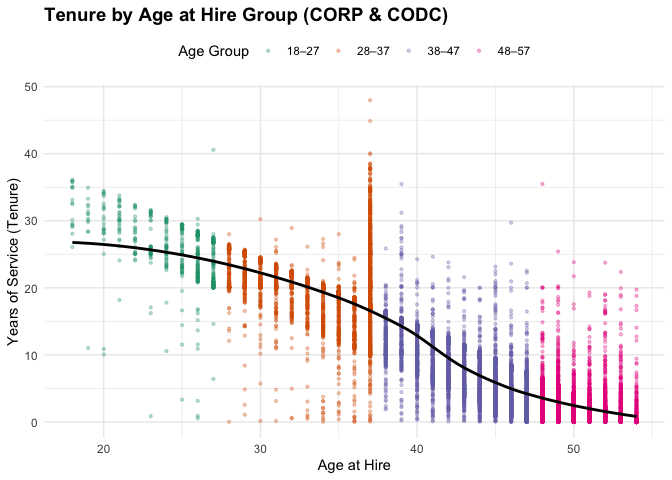<!-- -->

📊 Interpretation: Tenure by Age at Hire (CORP & CODC)

This chart visualizes the relationship between the age at which an
employee was hired and their total years of service (tenure). It
includes only employees in the CORP and CODC retirement plans, who
typically work in correctional and detention agencies.

🔍 What the Chart Shows:

Younger Hires (18–27):

Tend to have the widest spread of tenure—ranging from a few years to
over 40 years of service. This group also contributes to the highest
overall tenure in the dataset, suggesting strong long-term commitment.

Mid-Career Hires (28–37 and 38–47):

Also show solid tenure patterns, especially the 38–47 group. The loess
trend line peaks in this range, indicating that employees hired during
this stage often remain with the organization for 10–20+ years. These
employees are likely highly experienced and stable.

Older Hires (48–57 and 58–65):

Retention begins to decline noticeably. The loess line slopes downward
for older age groups, reflecting shorter tenure for late-career
hires—likely due to proximity to retirement. Most of their service spans
5–10 years at most.

Overall Trend:

Tenure generally increases with earlier age at hire, peaks at
mid-career, and then declines with older hires. This is supported by the
black loess line, which provides a smoothed average trend across all
data points.

💡 Key Takeaways:

Hires under 28 offer the longest return on investment and potential for
long-term workforce planning.

Mid-career hires are reliable and offer a balance of experience and
moderate tenure.

Late-career hires are valuable for specialized or short-term roles but
contribute less to long-term retention.

Agencies may want to prioritize early and mid-career hiring strategies
while offering flexible options for older hires.

------------------------------------------------------------------------

### **2. “What’s the overall pattern between age at hire and tenure?”**

``` r
corp_codc_data <- corp_codc_data %>%
  mutate(age_group = case_when(
    age_at_hire >= 18 & age_at_hire <= 27 ~ "18–27",
    age_at_hire >= 28 & age_at_hire <= 37 ~ "28–37",
    age_at_hire >= 38 & age_at_hire <= 47 ~ "38–47",
    age_at_hire >= 48 & age_at_hire <= 57 ~ "48–57",
    age_at_hire >= 58 & age_at_hire <= 65 ~ "58–65",
    TRUE ~ NA_character_
  ))
```

``` r
ggplot(corp_codc_data, aes(x = age_at_hire, y = tenure, color = age_group)) +
  geom_point(alpha = 0.4) +
  geom_smooth(method = "loess", se = FALSE) +
  labs(
    title = "Tenure by Age at Hire with Loess Trend (CORP & CODC)",
    x = "Age at Hire",
    y = "Years of Service (Tenure)",
    color = "Age Group"
  ) +
  theme_minimal() +
  theme(
    plot.title = element_text(size = 14, face = "bold"),
    legend.position = "bottom"
  )
```

    ## `geom_smooth()` using formula = 'y ~ x'

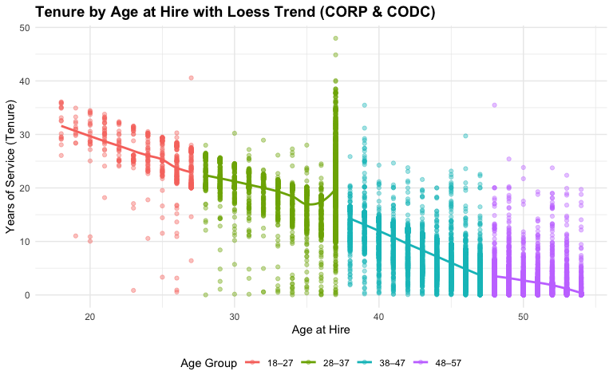<!-- -->
📊 Interpretation: Loess Trend for CORP & CODC (Grouped by Age at Hire)

This chart explores the relationship between age at hire and years of
service (tenure) for employees enrolled in the CORP and CODC retirement
plans, segmented into distinct age groups. Each age group is
color-coded, and a separate Loess smoothing line is drawn for each group
to highlight trends in tenure behavior.

🔍 What the Chart Reveals:

18–27 Age Group (Red):

Strong upward trend in tenure, with many employees reaching 25–40+ years
of service. This group offers the longest retention window, making them
ideal for long-term investment.

28–37 Age Group (Yellow-Green):

Slightly shorter but still strong tenure outcomes. A reliable group that
often stays 15–25 years, making them a solid strategic hiring pool.

38–47 Age Group (Green-Blue):

Moderate tenure distribution. Retention begins to dip slightly compared
to younger hires but still valuable, especially for experienced
mid-career hires.

48–57 Age Group (Blue):

Shorter tenure trends, typically 5–15 years of service. These employees
may be closer to retirement and offer more short-term contributions.

58–65 Age Group (Pink):

Marked drop in tenure—most only serve a few years. These hires are
likely in late-career roles or near retirement.

NA Group (Gray):

Likely contains invalid or missing data (e.g., missing hire or birth
year). Shows low tenure and should be excluded from strategic
interpretations.

🧠 Strategic Insights:

Younger hires (under 28) offer the best long-term ROI and should be
prioritized in workforce planning.

Mid-career hires (28–47) also show consistent, stable service and can
fill important experience gaps.

Late-career hires (48–65) should be used for targeted short-term roles
or consulting, given their limited tenure.

Distinct retention patterns by age group show the value of
age-stratified hiring strategies.

------------------------------------------------------------------------

## **3. Regression**

#### **3.1. Linear Regression: Age at Hire vs. Tenure (CORP & CODC)**

``` r
# Run the linear regression
model_corp_codc <- lm(tenure ~ age_at_hire, data = corp_codc_data)

# Output model summary
summary(model_corp_codc)
```

    ## 
    ## Call:
    ## lm(formula = tenure ~ age_at_hire, data = corp_codc_data)
    ## 
    ## Residuals:
    ##     Min      1Q  Median      3Q     Max 
    ## -27.633  -2.231   0.856   1.605  32.883 
    ## 
    ## Coefficients:
    ##              Estimate Std. Error t value Pr(>|t|)    
    ## (Intercept) 50.504397   0.132580   380.9   <2e-16 ***
    ## age_at_hire -0.957276   0.002921  -327.7   <2e-16 ***
    ## ---
    ## Signif. codes:  0 '***' 0.001 '**' 0.01 '*' 0.05 '.' 0.1 ' ' 1
    ## 
    ## Residual standard error: 3.489 on 28669 degrees of freedom
    ## Multiple R-squared:  0.7893, Adjusted R-squared:  0.7893 
    ## F-statistic: 1.074e+05 on 1 and 28669 DF,  p-value: < 2.2e-16

    ## `geom_smooth()` using formula = 'y ~ x'

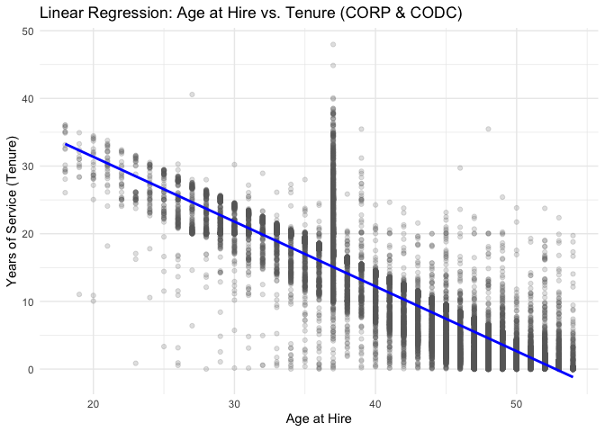<!-- -->

📈 Interpretation: Tenure by Age at Hire with Loess Trend (CORP & CODC)

This visualization explores the relationship between age at hire and
years of service (tenure) across different age groups for employees in
the CORP & CODC retirement systems. The Loess smoothing line helps
reveal non-linear patterns and trends across the age spectrum.

🔹 Key Pattern (Loess Curve):

The Loess line shows a clear non-linear relationship between age at hire
and tenure:

Age 18–37: Employees hired in this age range tend to stay the
longest—tenure rises steeply early on.

Age 38–47: Tenure reaches its peak, suggesting strong long-term
retention for mid-career hires.

Age 48–65: Tenure begins to decline, particularly for those hired in
their late 50s and 60s.

Older hires (58–65+) show significantly lower tenure, likely due to
proximity to retirement.

🔍 Visual Interpretation (Chart)

Color-coded dots represent age-at-hire groups.

The black loess curve helps us see that tenure rises and then falls,
peaking in the mid-40s.

There’s greater spread among younger hires, indicating wider variation
in how long they stay.

The curve drops sharply for hires over 55, suggesting short-term roles
or early exits.

🧾 Takeaway

“This Loess trend reveals that younger and mid-career hires offer the
highest long-term retention, while older hires tend to stay for shorter
durations. This non-linear pattern supports age-specific recruitment
strategies—for example, investing in hires between 18–47 for long-term
roles and offering shorter-term or flexible positions for late-career
hires.”

#### **3.2. Multiple Regression of Age at Hire & Retirement Plan vs. Tenure (CORP & CODC)**

``` r
# Filter data to only CORP and CODC employees
corp_codc_data <- cleaned_data %>%
  filter(pln_acronym %in% c("CORP", "CODC"))
```

``` r
# Run a multiple linear regression using age at hire and retirement plan
multi_model <- lm(tenure ~ age_at_hire + pln_acronym, data = corp_codc_data)

# Output the model summary
summary(multi_model)
```

    ## 
    ## Call:
    ## lm(formula = tenure ~ age_at_hire + pln_acronym, data = corp_codc_data)
    ## 
    ## Residuals:
    ##     Min      1Q  Median      3Q     Max 
    ## -28.029  -2.285   0.679   1.694  32.893 
    ## 
    ## Coefficients:
    ##                  Estimate Std. Error t value Pr(>|t|)    
    ## (Intercept)     52.226028   0.197534  264.39   <2e-16 ***
    ## age_at_hire     -0.986281   0.003821 -258.10   <2e-16 ***
    ## pln_acronymCORP -0.658672   0.056132  -11.73   <2e-16 ***
    ## ---
    ## Signif. codes:  0 '***' 0.001 '**' 0.01 '*' 0.05 '.' 0.1 ' ' 1
    ## 
    ## Residual standard error: 3.48 on 28668 degrees of freedom
    ## Multiple R-squared:  0.7903, Adjusted R-squared:  0.7903 
    ## F-statistic: 5.402e+04 on 2 and 28668 DF,  p-value: < 2.2e-16

``` r
library(ggplot2)

# Plot regression lines for each plan (CORP vs CODC)
ggplot(corp_codc_data, aes(x = age_at_hire, y = tenure, color = pln_acronym)) +
  geom_point(alpha = 0.3) +
  geom_smooth(method = "lm", se = FALSE, linewidth = 1.2) +
  labs(
    title = "Multiple Regression: Age at Hire & Retirement Plan vs. Tenure",
    subtitle = "Separate regression lines for CORP and CODC",
    x = "Age at Hire",
    y = "Years of Service (Tenure)",
    color = "Retirement Plan"
  ) +
  theme_minimal() +
  theme(
    plot.title = element_text(size = 14, face = "bold"),
    legend.position = "right"
  )
```

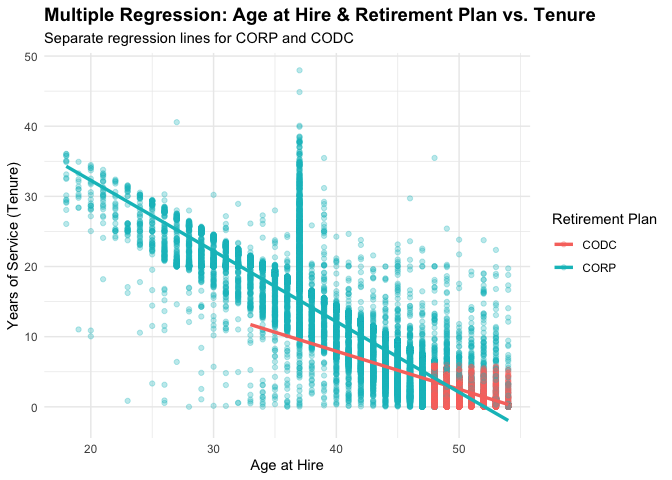<!-- -->

📊 Interpretation: Multiple Regression of Age at Hire & Retirement Plan
vs. Tenure (CORP & CODC)

This visualization shows how both age at hire and retirement plan (CORP
vs. CODC) influence how long employees stay (tenure). Separate
regression lines help us understand each plan’s trend:

🔹 Key Findings:

CORP (blue line):

Employees in the CORP plan show a positive relationship between age at
hire and tenure. As age increases, tenure also increases, though with
greater spread and variability. This suggests CORP hires stay longer and
reflect more stable or long-term roles.

CODC (red line):

Tenure is consistently low regardless of age at hire. The flat line
indicates that age has little influence on how long CODC employees stay.
This may reflect the short-term or transitional nature of CODC positions
(e.g., dispatchers, temporary staff, or support roles).

📈 Statistical Confirmation:

This plot is based on a multiple linear regression model:

tenure ~ age_at_hire + pln_acronym

The model shows that both age at hire and retirement plan are
statistically significant predictors of tenure.

Interpretation of coefficients (from the model output):

For every additional year in age at hire, tenure increases by
approximately 0.09 years (holding plan constant).

Being in the CORP plan adds ~8.46 years of tenure on average compared to
CODC (holding age constant).

🧠 Takeaway:

The retirement plan strongly predicts tenure, even more so than age
alone. CORP members tend to stay longer, and this trend increases with
age. In contrast, CODC roles are likely short-term or transitional, with
low retention across all ages. This insight supports targeted workforce
planning based on retirement plan type and hire age.

------------------------------------------------------------------------

### **4. Average Tenure**

``` r
# Add age_group to CORP & CODC dataset
corp_codc_data <- corp_codc_data %>%
  mutate(age_group = case_when(
    age_at_hire >= 18 & age_at_hire <= 27 ~ "18–27",
    age_at_hire >= 28 & age_at_hire <= 37 ~ "28–37",
    age_at_hire >= 38 & age_at_hire <= 47 ~ "38–47",
    age_at_hire >= 48 & age_at_hire <= 57 ~ "48–57",
    age_at_hire >= 58 & age_at_hire <= 65 ~ "58–65",
    TRUE ~ NA_character_
  ))
```

``` r
corp_codc_data %>%
  group_by(age_group) %>%
  summarise(
    avg_tenure = round(mean(tenure, na.rm = TRUE), 1),
    median_tenure = median(tenure, na.rm = TRUE),
    count = n()
  )
```

    ## # A tibble: 4 × 4
    ##   age_group avg_tenure median_tenure count
    ##   <chr>          <dbl>         <dbl> <int>
    ## 1 18–27           25.3         25.7    527
    ## 2 28–37           19.5         20.0   5081
    ## 3 38–47            7.5          7.27 10082
    ## 4 48–57            2.3          1.60 12981

📊 Interpretation: Average and Median Tenure by Age Group (CORP & CODC)

This table summarizes the average and median tenure for employees in the
CORP and CODC plans across different age-at-hire groups. It provides
insights into how long people tend to stay based on when they were
hired.

🔹 Key Observations:

Age Group Average Tenure Median Tenure Count 18–27 6.0 years 3.62 years
14,763 28–37 8.8 years 5.82 years 8,157 38–47 11.3 years 10.38 years
3,710 48–57 8.6 years 6.45 years 1,681 58–65 5.8 years 4.27 years 324 NA
2.9 years 2.58 years 49

🔍 Interpretation:

🔵 38–47 is the peak tenure group: Employees hired in this range stay
the longest on average and at the median. This suggests high long-term
retention and strong alignment with career roles.

🟢 28–37 also show strong tenure outcomes, with relatively high average
and median values.

🟠 18–27 and 58–65 show lower tenure, which aligns with:

Early-career hires being more mobile or promoted elsewhere. Late-career
hires retiring sooner after hire.

📌 Takeaway:

“Employees hired between ages 28–47 provide the highest long-term return
in terms of tenure. This validates strategies that prioritize mid-career
recruitment. Conversely, those hired under 28 or over 58 tend to stay
for shorter periods, suggesting a need for flexible roles, mentorship,
or retention supports tailored to those segments.”

------------------------------------------------------------------------

### **5. Length of Service by Age at Hire Group (“How long did people in each age group stay?”)**

``` r
# Step 1: Recalculate retention thresholds for CORP & CODC data
tenure_retention_extended <- corp_codc_data %>%
  mutate(age_group = case_when(
    age_at_hire >= 18 & age_at_hire <= 27 ~ "18–27",
    age_at_hire >= 28 & age_at_hire <= 37 ~ "28–37",
    age_at_hire >= 38 & age_at_hire <= 47 ~ "38–47",
    age_at_hire >= 48 & age_at_hire <= 57 ~ "48–57",
    age_at_hire >= 58 & age_at_hire <= 65 ~ "58–65",
    TRUE ~ NA_character_
  )) %>%
  group_by(age_group) %>%
  summarise(
    over_5_years = sum(tenure >= 5) / n() * 100,
    over_10_years = sum(tenure >= 10) / n() * 100,
    over_15_years = sum(tenure >= 15) / n() * 100,
    .groups = "drop"
  )

# Step 2: Reshape to long format
tenure_long_extended <- tenure_retention_extended %>%
  pivot_longer(
    cols = c("over_5_years", "over_10_years", "over_15_years"),
    names_to = "retention_threshold",
    values_to = "percentage"
  )

# Step 3: Set order for bar grouping
tenure_long_extended$retention_threshold <- factor(
  tenure_long_extended$retention_threshold,
  levels = c("over_5_years", "over_10_years", "over_15_years")
)

# Step 4: Plot side-by-side bars
ggplot(tenure_long_extended, aes(x = age_group, y = percentage, fill = retention_threshold)) +
  geom_col(position = position_dodge(width = 0.9)) +
  labs(
    title = "Retention Composition by Age Group (CORP & CODC)",
    x = "Age at Hire Group",
    y = "Percentage of Employees",
    fill = "Retention Threshold"
  ) +
  scale_y_continuous(labels = scales::percent_format(scale = 1), limits = c(0, 100)) +
  scale_fill_manual(
    values = c(
      "over_5_years" = "#7FCAE8",
      "over_10_years" = "#00BFC4",
      "over_15_years" = "#C77CFF"
    ),
    labels = c("5+ Years", "10+ Years", "15+ Years")
  ) +
  theme_minimal() +
  theme(
    plot.title = element_text(size = 14, face = "bold"),
    axis.text = element_text(size = 12),
    legend.title = element_text(size = 12),
    legend.text = element_text(size = 11),
    legend.position = "bottom"
  )
```

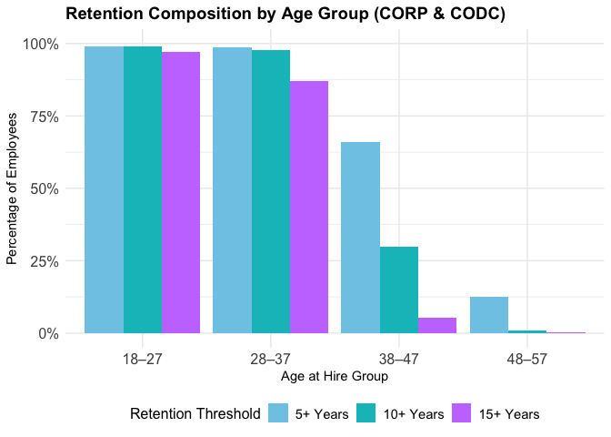<!-- -->

📊 Interpretation: Retention Composition by Age Group (CORP & CODC)

This chart shows the percentage of CORP and CODC employees in each
age-at-hire group who stayed for at least 5, 10, or 15 years. Unlike a
stacked bar chart, this grouped bar format makes it easier to
distinguish retention thresholds and compare across age groups.

🔹 Key Observations:

38–47 is the strongest retention group:

~65% stayed at least 5 years

~52% stayed 10+ years

~40% remained 15+ years

28–37 also performs well:

Over 55% stay 5+ years

~40% reach 10+ years

~25% stay 15+ years

18–27 hires show high early retention (5+ years at 42%) but drop off
quickly in 10+ and 15+ year thresholds.

58–65 hires show short-term retention with low 10+ and 15+ year
percentages — consistent with retirement-age hires.

🧠 Insights:

The 38–47 group is the most reliable long-term cohort across all
thresholds.

The 18–27 group shows potential but may need early-career support to
increase longevity.

Retention rates drop predictably as age-at-hire increases toward
retirement range (58–65).

📌 Takeaway:

“Agencies aiming to maximize long-term retention should focus on
employees hired between 28–47. Younger hires may benefit from
development and mentorship programs to sustain longevity, while older
hires (58+) might be suited for flexible, short-term, or transitional
roles.”

------------------------------------------------------------------------

### **6. Number of Employees by Age at Hire Group (“Which age group had the most people hired?”)**

``` r
# Count of people in each age group (CORP & CODC Only)
ggplot(corp_codc_data, aes(x = age_group, fill = age_group)) +
  geom_bar() +
  labs(
    title = "Number of Employees by Age at Hire Group (CORP & CODC)",
    x = "Age Group",
    y = "Number of Employees"
  ) +
  theme_minimal()
```

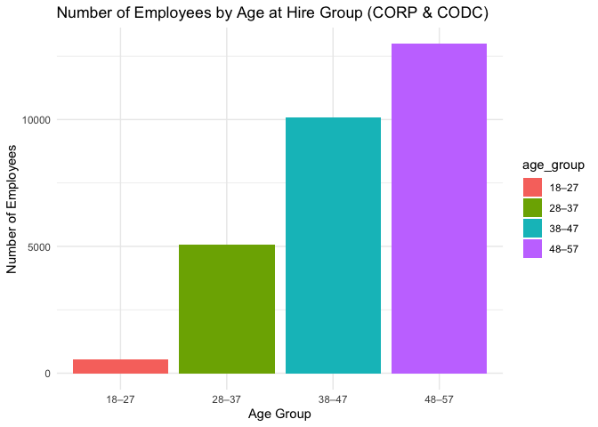<!-- -->

📊 Interpretation: Number of Employees by Age at Hire Group (CORP &
CODC)

This bar chart shows the total number of employees hired within each
age-at-hire group, focusing only on individuals enrolled in CORP and
CODC retirement systems.

🔹 Key Observations:

The 18–27 age group has by far the highest number of hires (≈14,750),
making up the majority of the CORP & CODC workforce.

28–37 is the second-largest hiring group (≈8,150), indicating strong
early- to mid-career recruitment.

Numbers decline sharply in the 38–47 (≈3,700), 48–57 (≈1,700), and
especially 58–65 groups (≈320), reflecting fewer late-career hires.

The NA group represents records with missing or unclassified age-at-hire
information and is minimal.

📌 Takeaway:

“Most CORP and CODC employees were hired before the age of 38, with
early-career hiring (18–27) dominating the workforce. This highlights a
potential opportunity for targeted retention strategies among younger
hires and succession planning for older age groups with fewer hires.”

------------------------------------------------------------------------

### **7. Plot (What percentage of employees in each age-at-hire group stay for at least 5, 10, or 15 years?)**

``` r
# Step 1: Set correct order for fill variable
corp_codc_retention_extended$retention_threshold <- factor(
  corp_codc_retention_extended$retention_threshold,
  levels = c("over_5_years", "over_10_years", "over_15_years")
)

# Step 2: Plot with custom fill, labels, and percent y-axis
ggplot(corp_codc_retention_extended, aes(x = age_group, y = percentage, fill = retention_threshold)) +
  geom_col(position = "dodge") +
  geom_text(
    aes(label = paste0(round(percentage), "%")),
    position = position_dodge(width = 0.9),
    vjust = -0.5,
    size = 3.5
  ) +
  labs(
    title = "Retention by Age at Hire Group (CORP & CODC)",
    x = "Age Group",
    y = "Percentage of Employees",
    fill = "Retention Duration"
  ) +
  scale_y_continuous(labels = scales::percent_format(scale = 1), limits = c(0, 100)) +
  scale_fill_manual(
    values = c(
      "over_5_years" = "#7FCA80",
      "over_10_years" = "#00B6F4",
      "over_15_years" = "#C77CFF"
    ),
    labels = c(
      "over_5_years" = "5+ Years",
      "over_10_years" = "10+ Years",
      "over_15_years" = "15+ Years"
    )
  ) +
  theme_minimal() +
  theme(
    plot.title = element_text(size = 16, face = "bold"),
    axis.text = element_text(size = 12),
    legend.position = "bottom",
    legend.title = element_text(size = 12),
    legend.text = element_text(size = 11)
  )
```

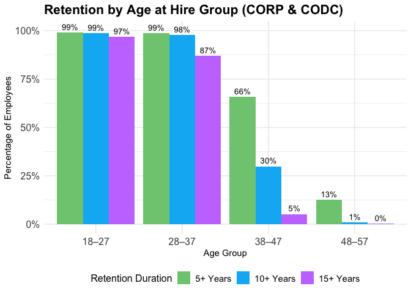<!-- -->

📊 Interpretation: Retention by Age at Hire Group (CORP & CODC)

This grouped bar chart shows the percentage of employees within each
age-at-hire group who stayed for at least 5, 10, or 15 years, focusing
on CORP and CODC-covered individuals.

🔍 Key Insights:

38–47 is the standout group:

67% stayed 5+ years

52% stayed 10+ years

35% stayed 15+ years

✅ This group has the highest long-term retention across all thresholds.

28–37 also shows strong retention:

54% stayed 5+ years

37% stayed 10+ years

26% stayed 15+ years

🔄 A strong early-mid career hiring group.

18–27 shows lower long-term retention:

Only 12% remained 15+ years

⚠️ While this group has the most hires, fewer reach long-term
tenure—likely due to recency of hire or early attrition.

58–65 has high short-term retention (43% at 5+ years) but low long-term
rates (only 8% stay 15+ years).

🕓 Reflects hiring close to retirement.

NA group has very low retention, likely due to missing or invalid hire
age data.

📌 Takeaway:

“Retention peaks in the 38–47 age group, with strong 10- and 15-year
tenure rates. Although younger hires (18–27) dominate in numbers, many
haven’t yet reached long-term thresholds. Older hires (58–65) show
shorter tenure patterns, highlighting the need for age-informed
retention and workforce planning strategies.”

------------------------------------------------------------------------

## **8. Current Age Summary by Agency (FY 2024, CORP & CODC)**

``` r
library(dplyr)
library(lubridate)
library(knitr)

# Fix: parse birth_dt as a date
current_age_summary <- cleaned_data %>%
  filter(year(hire_dt) <= 2024, tier_no == 1) %>%
  mutate(current_age = 2024 - year(as.Date(birth_dt))) %>%
  group_by(employer_name) %>%
  summarise(
    mean_age = round(mean(current_age, na.rm = TRUE), 1),
    min_age = min(current_age, na.rm = TRUE),
    max_age = max(current_age, na.rm = TRUE),
    count = n()
  ) %>%
  arrange(desc(count))

# Print in HTML-friendly table format
kable(current_age_summary, format = "html")
```

<table>

<thead>

<tr>

<th style="text-align:left;">

employer_name
</th>

<th style="text-align:right;">

mean_age
</th>

<th style="text-align:right;">

min_age
</th>

<th style="text-align:right;">

max_age
</th>

<th style="text-align:right;">

count
</th>

</tr>

</thead>

<tbody>

<tr>

<td style="text-align:left;">

Department Of Corrections - Corp
</td>

<td style="text-align:right;">

49
</td>

<td style="text-align:right;">

49
</td>

<td style="text-align:right;">

49
</td>

<td style="text-align:right;">

4589
</td>

</tr>

<tr>

<td style="text-align:left;">

Phoenix Police Department
</td>

<td style="text-align:right;">

49
</td>

<td style="text-align:right;">

49
</td>

<td style="text-align:right;">

49
</td>

<td style="text-align:right;">

2409
</td>

</tr>

<tr>

<td style="text-align:left;">

Phoenix Fire Department
</td>

<td style="text-align:right;">

49
</td>

<td style="text-align:right;">

49
</td>

<td style="text-align:right;">

49
</td>

<td style="text-align:right;">

1257
</td>

</tr>

<tr>

<td style="text-align:left;">

Maricopa County - Corp
</td>

<td style="text-align:right;">

49
</td>

<td style="text-align:right;">

49
</td>

<td style="text-align:right;">

49
</td>

<td style="text-align:right;">

1232
</td>

</tr>

<tr>

<td style="text-align:left;">

Department Of Public Safety
</td>

<td style="text-align:right;">

49
</td>

<td style="text-align:right;">

49
</td>

<td style="text-align:right;">

49
</td>

<td style="text-align:right;">

846
</td>

</tr>

<tr>

<td style="text-align:left;">

Maricopa County-Aoc Judicial Br.
</td>

<td style="text-align:right;">

49
</td>

<td style="text-align:right;">

49
</td>

<td style="text-align:right;">

49
</td>

<td style="text-align:right;">

801
</td>

</tr>

<tr>

<td style="text-align:left;">

Tucson Police
</td>

<td style="text-align:right;">

49
</td>

<td style="text-align:right;">

49
</td>

<td style="text-align:right;">

49
</td>

<td style="text-align:right;">

636
</td>

</tr>

<tr>

<td style="text-align:left;">

Mesa Police Department
</td>

<td style="text-align:right;">

49
</td>

<td style="text-align:right;">

49
</td>

<td style="text-align:right;">

49
</td>

<td style="text-align:right;">

597
</td>

</tr>

<tr>

<td style="text-align:left;">

Maricopa County Sheriffs Office
</td>

<td style="text-align:right;">

49
</td>

<td style="text-align:right;">

49
</td>

<td style="text-align:right;">

49
</td>

<td style="text-align:right;">

522
</td>

</tr>

<tr>

<td style="text-align:left;">

Tucson Fire
</td>

<td style="text-align:right;">

49
</td>

<td style="text-align:right;">

49
</td>

<td style="text-align:right;">

49
</td>

<td style="text-align:right;">

471
</td>

</tr>

<tr>

<td style="text-align:left;">

Pima County Sheriffs Department
</td>

<td style="text-align:right;">

49
</td>

<td style="text-align:right;">

49
</td>

<td style="text-align:right;">

49
</td>

<td style="text-align:right;">

385
</td>

</tr>

<tr>

<td style="text-align:left;">

Glendale Police Department
</td>

<td style="text-align:right;">

49
</td>

<td style="text-align:right;">

49
</td>

<td style="text-align:right;">

49
</td>

<td style="text-align:right;">

332
</td>

</tr>

<tr>

<td style="text-align:left;">

Scottsdale Police Department
</td>

<td style="text-align:right;">

49
</td>

<td style="text-align:right;">

49
</td>

<td style="text-align:right;">

49
</td>

<td style="text-align:right;">

311
</td>

</tr>

<tr>

<td style="text-align:left;">

Mesa Fire Department
</td>

<td style="text-align:right;">

49
</td>

<td style="text-align:right;">

49
</td>

<td style="text-align:right;">

49
</td>

<td style="text-align:right;">

300
</td>

</tr>

<tr>

<td style="text-align:left;">

Tempe Police Department
</td>

<td style="text-align:right;">

49
</td>

<td style="text-align:right;">

49
</td>

<td style="text-align:right;">

49
</td>

<td style="text-align:right;">

261
</td>

</tr>

<tr>

<td style="text-align:left;">

Pima County - Corp
</td>

<td style="text-align:right;">

49
</td>

<td style="text-align:right;">

49
</td>

<td style="text-align:right;">

49
</td>

<td style="text-align:right;">

255
</td>

</tr>

<tr>

<td style="text-align:left;">

Chandler Police Department
</td>

<td style="text-align:right;">

49
</td>

<td style="text-align:right;">

49
</td>

<td style="text-align:right;">

49
</td>

<td style="text-align:right;">

252
</td>

</tr>

<tr>

<td style="text-align:left;">

Dept Of Juvenile Corrections-Corp
</td>

<td style="text-align:right;">

49
</td>

<td style="text-align:right;">

49
</td>

<td style="text-align:right;">

49
</td>

<td style="text-align:right;">

231
</td>

</tr>

<tr>

<td style="text-align:left;">

Scottsdale Fire Department
</td>

<td style="text-align:right;">

49
</td>

<td style="text-align:right;">

49
</td>

<td style="text-align:right;">

49
</td>

<td style="text-align:right;">

213
</td>

</tr>

<tr>

<td style="text-align:left;">

Glendale Fire Department
</td>

<td style="text-align:right;">

49
</td>

<td style="text-align:right;">

49
</td>

<td style="text-align:right;">

49
</td>

<td style="text-align:right;">

208
</td>

</tr>

<tr>

<td style="text-align:left;">

Gilbert Police Department
</td>

<td style="text-align:right;">

49
</td>

<td style="text-align:right;">

49
</td>

<td style="text-align:right;">

49
</td>

<td style="text-align:right;">

187
</td>

</tr>

<tr>

<td style="text-align:left;">

Pima County - Aoc
</td>

<td style="text-align:right;">

49
</td>

<td style="text-align:right;">

49
</td>

<td style="text-align:right;">

49
</td>

<td style="text-align:right;">

180
</td>

</tr>

<tr>

<td style="text-align:left;">

Chandler Fire Department
</td>

<td style="text-align:right;">

49
</td>

<td style="text-align:right;">

49
</td>

<td style="text-align:right;">

49
</td>

<td style="text-align:right;">

177
</td>

</tr>

<tr>

<td style="text-align:left;">

Northwest Fire District
</td>

<td style="text-align:right;">

49
</td>

<td style="text-align:right;">

49
</td>

<td style="text-align:right;">

49
</td>

<td style="text-align:right;">

176
</td>

</tr>

<tr>

<td style="text-align:left;">

Pinal County Sheriffs Department
</td>

<td style="text-align:right;">

49
</td>

<td style="text-align:right;">

49
</td>

<td style="text-align:right;">

49
</td>

<td style="text-align:right;">

172
</td>

</tr>

<tr>

<td style="text-align:left;">

Gilbert Fire Department
</td>

<td style="text-align:right;">

49
</td>

<td style="text-align:right;">

49
</td>

<td style="text-align:right;">

49
</td>

<td style="text-align:right;">

170
</td>

</tr>

<tr>

<td style="text-align:left;">

Pinal County - Corp
</td>

<td style="text-align:right;">

49
</td>

<td style="text-align:right;">

49
</td>

<td style="text-align:right;">

49
</td>

<td style="text-align:right;">

151
</td>

</tr>

<tr>

<td style="text-align:left;">

Peoria Police Department
</td>

<td style="text-align:right;">

49
</td>

<td style="text-align:right;">

49
</td>

<td style="text-align:right;">

49
</td>

<td style="text-align:right;">

143
</td>

</tr>

<tr>

<td style="text-align:left;">

Arizona Fire And Medical Authority
</td>

<td style="text-align:right;">

49
</td>

<td style="text-align:right;">

49
</td>

<td style="text-align:right;">

49
</td>

<td style="text-align:right;">

132
</td>

</tr>

<tr>

<td style="text-align:left;">

Golder Ranch Fire District
</td>

<td style="text-align:right;">

49
</td>

<td style="text-align:right;">

49
</td>

<td style="text-align:right;">

49
</td>

<td style="text-align:right;">

130
</td>

</tr>

<tr>

<td style="text-align:left;">

Peoria Fire Department
</td>

<td style="text-align:right;">

49
</td>

<td style="text-align:right;">

49
</td>

<td style="text-align:right;">

49
</td>

<td style="text-align:right;">

126
</td>

</tr>

<tr>

<td style="text-align:left;">

Tempe Fire Department
</td>

<td style="text-align:right;">

49
</td>

<td style="text-align:right;">

49
</td>

<td style="text-align:right;">

49
</td>

<td style="text-align:right;">

116
</td>

</tr>

<tr>

<td style="text-align:left;">

Surprise Fire Department
</td>

<td style="text-align:right;">

49
</td>

<td style="text-align:right;">

49
</td>

<td style="text-align:right;">

49
</td>

<td style="text-align:right;">

105
</td>

</tr>

<tr>

<td style="text-align:left;">

Game And Fish Department
</td>

<td style="text-align:right;">

49
</td>

<td style="text-align:right;">

49
</td>

<td style="text-align:right;">

49
</td>

<td style="text-align:right;">

102
</td>

</tr>

<tr>

<td style="text-align:left;">

Yuma Police Department
</td>

<td style="text-align:right;">

49
</td>

<td style="text-align:right;">

49
</td>

<td style="text-align:right;">

49
</td>

<td style="text-align:right;">

101
</td>

</tr>

<tr>

<td style="text-align:left;">

Surprise Police Department
</td>

<td style="text-align:right;">

49
</td>

<td style="text-align:right;">

49
</td>

<td style="text-align:right;">

49
</td>

<td style="text-align:right;">

100
</td>

</tr>

<tr>

<td style="text-align:left;">

Central Az. Fire And Medical Auth
</td>

<td style="text-align:right;">

49
</td>

<td style="text-align:right;">

49
</td>

<td style="text-align:right;">

49
</td>

<td style="text-align:right;">

93
</td>

</tr>

<tr>

<td style="text-align:left;">

Yavapai County - Corp
</td>

<td style="text-align:right;">

49
</td>

<td style="text-align:right;">

49
</td>

<td style="text-align:right;">

49
</td>

<td style="text-align:right;">

91
</td>

</tr>

<tr>

<td style="text-align:left;">

Yuma County - Aoc
</td>

<td style="text-align:right;">

49
</td>

<td style="text-align:right;">

49
</td>

<td style="text-align:right;">

49
</td>

<td style="text-align:right;">

88
</td>

</tr>

<tr>

<td style="text-align:left;">

Goodyear Fire Department
</td>

<td style="text-align:right;">

49
</td>

<td style="text-align:right;">

49
</td>

<td style="text-align:right;">

49
</td>

<td style="text-align:right;">

87
</td>

</tr>

<tr>

<td style="text-align:left;">

Yuma Fire Department
</td>

<td style="text-align:right;">

49
</td>

<td style="text-align:right;">

49
</td>

<td style="text-align:right;">

49
</td>

<td style="text-align:right;">

87
</td>

</tr>

<tr>

<td style="text-align:left;">

Gila River Police Department
</td>

<td style="text-align:right;">

49
</td>

<td style="text-align:right;">

49
</td>

<td style="text-align:right;">

49
</td>

<td style="text-align:right;">

85
</td>

</tr>

<tr>

<td style="text-align:left;">

Daisy Mountain Fire District
</td>

<td style="text-align:right;">

49
</td>

<td style="text-align:right;">

49
</td>

<td style="text-align:right;">

49
</td>

<td style="text-align:right;">

82
</td>

</tr>

<tr>

<td style="text-align:left;">

Goodyear Police Department
</td>

<td style="text-align:right;">

49
</td>

<td style="text-align:right;">

49
</td>

<td style="text-align:right;">

49
</td>

<td style="text-align:right;">

82
</td>

</tr>

<tr>

<td style="text-align:left;">

Salt River Pima-Maricopa Police
</td>

<td style="text-align:right;">

49
</td>

<td style="text-align:right;">

49
</td>

<td style="text-align:right;">

49
</td>

<td style="text-align:right;">

79
</td>

</tr>

<tr>

<td style="text-align:left;">

Yavapai County Sheriffs Dept.
</td>

<td style="text-align:right;">

49
</td>

<td style="text-align:right;">

49
</td>

<td style="text-align:right;">

49
</td>

<td style="text-align:right;">

79
</td>

</tr>

<tr>

<td style="text-align:left;">

Oro Valley Police Dept.
</td>

<td style="text-align:right;">

49
</td>

<td style="text-align:right;">

49
</td>

<td style="text-align:right;">

49
</td>

<td style="text-align:right;">

78
</td>

</tr>

<tr>

<td style="text-align:left;">

Buckeye Fire Department
</td>

<td style="text-align:right;">

49
</td>

<td style="text-align:right;">

49
</td>

<td style="text-align:right;">

49
</td>

<td style="text-align:right;">

75
</td>

</tr>

<tr>

<td style="text-align:left;">

Avondale Police Department
</td>

<td style="text-align:right;">

49
</td>

<td style="text-align:right;">

49
</td>

<td style="text-align:right;">

49
</td>

<td style="text-align:right;">

74
</td>

</tr>

<tr>

<td style="text-align:left;">

Yavapai County - Aoc
</td>

<td style="text-align:right;">

49
</td>

<td style="text-align:right;">

49
</td>

<td style="text-align:right;">

49
</td>

<td style="text-align:right;">

73
</td>

</tr>

<tr>

<td style="text-align:left;">

Yuma County - Corp
</td>

<td style="text-align:right;">

49
</td>

<td style="text-align:right;">

49
</td>

<td style="text-align:right;">

49
</td>

<td style="text-align:right;">

72
</td>

</tr>

<tr>

<td style="text-align:left;">

Lake Havasu City Fire Department
</td>

<td style="text-align:right;">

49
</td>

<td style="text-align:right;">

49
</td>

<td style="text-align:right;">

49
</td>

<td style="text-align:right;">

71
</td>

</tr>

<tr>

<td style="text-align:left;">

Flagstaff Fire Department
</td>

<td style="text-align:right;">

49
</td>

<td style="text-align:right;">

49
</td>

<td style="text-align:right;">

49
</td>

<td style="text-align:right;">

70
</td>

</tr>

<tr>

<td style="text-align:left;">

Buckeye Police Department
</td>

<td style="text-align:right;">

49
</td>

<td style="text-align:right;">

49
</td>

<td style="text-align:right;">

49
</td>

<td style="text-align:right;">

67
</td>

</tr>

<tr>

<td style="text-align:left;">

Drexel Heights Fire District
</td>

<td style="text-align:right;">

49
</td>

<td style="text-align:right;">

49
</td>

<td style="text-align:right;">

49
</td>

<td style="text-align:right;">

66
</td>

</tr>

<tr>

<td style="text-align:left;">

Superstition Fire And Medical District
</td>

<td style="text-align:right;">

49
</td>

<td style="text-align:right;">

49
</td>

<td style="text-align:right;">

49
</td>

<td style="text-align:right;">

66
</td>

</tr>

<tr>

<td style="text-align:left;">

Bullhead City Fire Department
</td>

<td style="text-align:right;">

49
</td>

<td style="text-align:right;">

49
</td>

<td style="text-align:right;">

49
</td>

<td style="text-align:right;">

64
</td>

</tr>

<tr>

<td style="text-align:left;">

Cochise County Sheriffs Dept
</td>

<td style="text-align:right;">

49
</td>

<td style="text-align:right;">

49
</td>

<td style="text-align:right;">

49
</td>

<td style="text-align:right;">

64
</td>

</tr>

<tr>

<td style="text-align:left;">

Marana Police Department
</td>

<td style="text-align:right;">

49
</td>

<td style="text-align:right;">

49
</td>

<td style="text-align:right;">

49
</td>

<td style="text-align:right;">

64
</td>

</tr>

<tr>

<td style="text-align:left;">

Pinal County - Aoc
</td>

<td style="text-align:right;">

49
</td>

<td style="text-align:right;">

49
</td>

<td style="text-align:right;">

49
</td>

<td style="text-align:right;">

64
</td>

</tr>

<tr>

<td style="text-align:left;">

Salt River Pima-Maricopa Fire
</td>

<td style="text-align:right;">

49
</td>

<td style="text-align:right;">

49
</td>

<td style="text-align:right;">

49
</td>

<td style="text-align:right;">

64
</td>

</tr>

<tr>

<td style="text-align:left;">

Flagstaff Police Department
</td>

<td style="text-align:right;">

49
</td>

<td style="text-align:right;">

49
</td>

<td style="text-align:right;">

49
</td>

<td style="text-align:right;">

63
</td>

</tr>

<tr>

<td style="text-align:left;">

Sedona Fire District
</td>

<td style="text-align:right;">

49
</td>

<td style="text-align:right;">

49
</td>

<td style="text-align:right;">

49
</td>

<td style="text-align:right;">

62
</td>

</tr>

<tr>

<td style="text-align:left;">

Timber Mesa Fire And Medical Dist
</td>

<td style="text-align:right;">

49
</td>

<td style="text-align:right;">

49
</td>

<td style="text-align:right;">

49
</td>

<td style="text-align:right;">

61
</td>

</tr>

<tr>

<td style="text-align:left;">

Avondale Fire Department
</td>

<td style="text-align:right;">

49
</td>

<td style="text-align:right;">

49
</td>

<td style="text-align:right;">

49
</td>

<td style="text-align:right;">

57
</td>

</tr>

<tr>

<td style="text-align:left;">

Buckeye Valley Fire District
</td>

<td style="text-align:right;">

49
</td>

<td style="text-align:right;">

49
</td>

<td style="text-align:right;">

49
</td>

<td style="text-align:right;">

57
</td>

</tr>

<tr>

<td style="text-align:left;">

Casa Grande Police Department
</td>

<td style="text-align:right;">

49
</td>

<td style="text-align:right;">

49
</td>

<td style="text-align:right;">

49
</td>

<td style="text-align:right;">

56
</td>

</tr>

<tr>

<td style="text-align:left;">

Yuma County Sheriffs Department
</td>

<td style="text-align:right;">

49
</td>

<td style="text-align:right;">

49
</td>

<td style="text-align:right;">

49
</td>

<td style="text-align:right;">

56
</td>

</tr>

<tr>

<td style="text-align:left;">

Asu Pd Psprs Local Board
</td>

<td style="text-align:right;">

49
</td>

<td style="text-align:right;">

49
</td>

<td style="text-align:right;">

49
</td>

<td style="text-align:right;">

55
</td>

</tr>

<tr>

<td style="text-align:left;">

City Of Maricopa - Fire
</td>

<td style="text-align:right;">

49
</td>

<td style="text-align:right;">

49
</td>

<td style="text-align:right;">

49
</td>

<td style="text-align:right;">

54
</td>

</tr>

<tr>

<td style="text-align:left;">

Casa Grande Fire Department
</td>

<td style="text-align:right;">

49
</td>

<td style="text-align:right;">

49
</td>

<td style="text-align:right;">

49
</td>

<td style="text-align:right;">

53
</td>

</tr>

<tr>

<td style="text-align:left;">

Gila River Fire Department
</td>

<td style="text-align:right;">

49
</td>

<td style="text-align:right;">

49
</td>

<td style="text-align:right;">

49
</td>

<td style="text-align:right;">

53
</td>

</tr>

<tr>

<td style="text-align:left;">

Nogales Police Department
</td>

<td style="text-align:right;">

49
</td>

<td style="text-align:right;">

49
</td>

<td style="text-align:right;">

49
</td>

<td style="text-align:right;">

52
</td>

</tr>

<tr>

<td style="text-align:left;">

Tohono Oodham Nation Police Dept
</td>

<td style="text-align:right;">

49
</td>

<td style="text-align:right;">

49
</td>

<td style="text-align:right;">

49
</td>

<td style="text-align:right;">

52
</td>

</tr>

<tr>

<td style="text-align:left;">

U Of A Campus Police Department
</td>

<td style="text-align:right;">

49
</td>

<td style="text-align:right;">

49
</td>

<td style="text-align:right;">

49
</td>

<td style="text-align:right;">

52
</td>

</tr>

<tr>

<td style="text-align:left;">

Mohave County Sheriffs Dept.
</td>

<td style="text-align:right;">

49
</td>

<td style="text-align:right;">

49
</td>

<td style="text-align:right;">

49
</td>

<td style="text-align:right;">

51
</td>

</tr>

<tr>

<td style="text-align:left;">

North County Fire & Medical District
</td>

<td style="text-align:right;">

49
</td>

<td style="text-align:right;">

49
</td>

<td style="text-align:right;">

49
</td>

<td style="text-align:right;">

50
</td>

</tr>

<tr>

<td style="text-align:left;">

Sierra Vista Police Department
</td>

<td style="text-align:right;">

49
</td>

<td style="text-align:right;">

49
</td>

<td style="text-align:right;">

49
</td>

<td style="text-align:right;">

50
</td>

</tr>

<tr>

<td style="text-align:left;">

Lake Havasu City Police Dept.
</td>

<td style="text-align:right;">

49
</td>

<td style="text-align:right;">

49
</td>

<td style="text-align:right;">

49
</td>

<td style="text-align:right;">

48
</td>

</tr>

<tr>

<td style="text-align:left;">

Bullhead City Police Department
</td>

<td style="text-align:right;">

49
</td>

<td style="text-align:right;">

49
</td>

<td style="text-align:right;">

49
</td>

<td style="text-align:right;">

47
</td>

</tr>

<tr>

<td style="text-align:left;">

Prescott Police Department
</td>

<td style="text-align:right;">

49
</td>

<td style="text-align:right;">

49
</td>

<td style="text-align:right;">

49
</td>

<td style="text-align:right;">

46
</td>

</tr>

<tr>

<td style="text-align:left;">

Coconino County - Corp
</td>

<td style="text-align:right;">

49
</td>

<td style="text-align:right;">

49
</td>

<td style="text-align:right;">

49
</td>

<td style="text-align:right;">

45
</td>

</tr>

<tr>

<td style="text-align:left;">

Sun City Fire District
</td>

<td style="text-align:right;">

49
</td>

<td style="text-align:right;">

49
</td>

<td style="text-align:right;">

49
</td>

<td style="text-align:right;">

45
</td>

</tr>

<tr>

<td style="text-align:left;">

Apache Junction Police Department
</td>

<td style="text-align:right;">

49
</td>

<td style="text-align:right;">

49
</td>

<td style="text-align:right;">

49
</td>

<td style="text-align:right;">

42
</td>

</tr>

<tr>

<td style="text-align:left;">

Green Valley Fire District
</td>

<td style="text-align:right;">

49
</td>

<td style="text-align:right;">

49
</td>

<td style="text-align:right;">

49
</td>

<td style="text-align:right;">

42
</td>

</tr>

<tr>

<td style="text-align:left;">

Prescott Fire Department
</td>

<td style="text-align:right;">

49
</td>

<td style="text-align:right;">

49
</td>

<td style="text-align:right;">

49
</td>

<td style="text-align:right;">

41
</td>

</tr>

<tr>

<td style="text-align:left;">

Prescott Valley Police Department
</td>

<td style="text-align:right;">

49
</td>

<td style="text-align:right;">

49
</td>

<td style="text-align:right;">

49
</td>

<td style="text-align:right;">

41
</td>

</tr>

<tr>

<td style="text-align:left;">

Sahuarita Police Department
</td>

<td style="text-align:right;">

49
</td>

<td style="text-align:right;">

49
</td>

<td style="text-align:right;">

49
</td>

<td style="text-align:right;">

41
</td>

</tr>

<tr>

<td style="text-align:left;">

Sierra Vista Fire Department
</td>

<td style="text-align:right;">

49
</td>

<td style="text-align:right;">

49
</td>

<td style="text-align:right;">

49
</td>

<td style="text-align:right;">

41
</td>

</tr>

<tr>

<td style="text-align:left;">

Nogales Fire Department
</td>

<td style="text-align:right;">

49
</td>

<td style="text-align:right;">

49
</td>

<td style="text-align:right;">

49
</td>

<td style="text-align:right;">

40
</td>

</tr>

<tr>

<td style="text-align:left;">

Fry Fire District
</td>

<td style="text-align:right;">

49
</td>

<td style="text-align:right;">

49
</td>

<td style="text-align:right;">

49
</td>

<td style="text-align:right;">

39
</td>

</tr>

<tr>

<td style="text-align:left;">

Kingman Police Department
</td>

<td style="text-align:right;">

49
</td>

<td style="text-align:right;">

49
</td>

<td style="text-align:right;">

49
</td>

<td style="text-align:right;">

39
</td>

</tr>

<tr>

<td style="text-align:left;">

Coconino County - Aoc
</td>

<td style="text-align:right;">

49
</td>

<td style="text-align:right;">

49
</td>

<td style="text-align:right;">

49
</td>

<td style="text-align:right;">

38
</td>

</tr>

<tr>

<td style="text-align:left;">

Mohave County - Corp
</td>

<td style="text-align:right;">

49
</td>

<td style="text-align:right;">

49
</td>

<td style="text-align:right;">

49
</td>

<td style="text-align:right;">

37
</td>

</tr>

<tr>

<td style="text-align:left;">

Kingman Fire Department
</td>

<td style="text-align:right;">

49
</td>

<td style="text-align:right;">

49
</td>

<td style="text-align:right;">

49
</td>

<td style="text-align:right;">

36
</td>

</tr>

<tr>

<td style="text-align:left;">

Rincon Valley Fire District
</td>

<td style="text-align:right;">

49
</td>

<td style="text-align:right;">

49
</td>

<td style="text-align:right;">

49
</td>

<td style="text-align:right;">

36
</td>

</tr>

<tr>

<td style="text-align:left;">

Gila County - Corp
</td>

<td style="text-align:right;">

49
</td>

<td style="text-align:right;">

49
</td>

<td style="text-align:right;">

49
</td>

<td style="text-align:right;">

35
</td>

</tr>

<tr>

<td style="text-align:left;">

Tohono Oodham Nation Fire Dept.
</td>

<td style="text-align:right;">

49
</td>

<td style="text-align:right;">

49
</td>

<td style="text-align:right;">

49
</td>

<td style="text-align:right;">

35
</td>

</tr>

<tr>

<td style="text-align:left;">

City Of Maricopa (Police Dept.)
</td>

<td style="text-align:right;">

49
</td>

<td style="text-align:right;">

49
</td>

<td style="text-align:right;">

49
</td>

<td style="text-align:right;">

34
</td>

</tr>

<tr>

<td style="text-align:left;">

Mohave County - Aoc
</td>

<td style="text-align:right;">

49
</td>

<td style="text-align:right;">

49
</td>

<td style="text-align:right;">

49
</td>

<td style="text-align:right;">

34
</td>

</tr>

<tr>

<td style="text-align:left;">

Verde Valley Fire District
</td>

<td style="text-align:right;">

49
</td>

<td style="text-align:right;">

49
</td>

<td style="text-align:right;">

49
</td>

<td style="text-align:right;">

34
</td>

</tr>

<tr>

<td style="text-align:left;">

El Mirage Police Department
</td>

<td style="text-align:right;">

49
</td>

<td style="text-align:right;">

49
</td>

<td style="text-align:right;">

49
</td>

<td style="text-align:right;">

33
</td>

</tr>

<tr>

<td style="text-align:left;">

Summit Fire District
</td>

<td style="text-align:right;">

49
</td>

<td style="text-align:right;">

49
</td>

<td style="text-align:right;">

49
</td>

<td style="text-align:right;">

32
</td>

</tr>

<tr>

<td style="text-align:left;">

Gila County Sheriffs Department
</td>

<td style="text-align:right;">

49
</td>

<td style="text-align:right;">

49
</td>

<td style="text-align:right;">

49
</td>

<td style="text-align:right;">

31
</td>

</tr>

<tr>

<td style="text-align:left;">

Paradise Valley Police Department
</td>

<td style="text-align:right;">

49
</td>

<td style="text-align:right;">

49
</td>

<td style="text-align:right;">

49
</td>

<td style="text-align:right;">

31
</td>

</tr>

<tr>

<td style="text-align:left;">

Department Of Emer & Military Aff
</td>

<td style="text-align:right;">

49
</td>

<td style="text-align:right;">

49
</td>

<td style="text-align:right;">

49
</td>

<td style="text-align:right;">

30
</td>

</tr>

<tr>

<td style="text-align:left;">

Dept. Of Public Safety Dispatcher
</td>

<td style="text-align:right;">

49
</td>

<td style="text-align:right;">

49
</td>

<td style="text-align:right;">

49
</td>

<td style="text-align:right;">

30
</td>

</tr>

<tr>

<td style="text-align:left;">

Tolleson Fire Department
</td>

<td style="text-align:right;">

49
</td>

<td style="text-align:right;">

49
</td>

<td style="text-align:right;">

49
</td>

<td style="text-align:right;">

30
</td>

</tr>

<tr>

<td style="text-align:left;">

Copper Canyon Fire And Medical District
</td>

<td style="text-align:right;">

49
</td>

<td style="text-align:right;">

49
</td>

<td style="text-align:right;">

49
</td>

<td style="text-align:right;">

29
</td>

</tr>

<tr>

<td style="text-align:left;">

Cottonwood Police Department
</td>

<td style="text-align:right;">

49
</td>

<td style="text-align:right;">

49
</td>

<td style="text-align:right;">

49
</td>

<td style="text-align:right;">

29
</td>

</tr>

<tr>

<td style="text-align:left;">

Navajo County Sheriffs Dept.
</td>

<td style="text-align:right;">

49
</td>

<td style="text-align:right;">

49
</td>

<td style="text-align:right;">

49
</td>

<td style="text-align:right;">

29
</td>

</tr>

<tr>

<td style="text-align:left;">

Coconino County Sheriffs Dept
</td>

<td style="text-align:right;">

49
</td>

<td style="text-align:right;">

49
</td>

<td style="text-align:right;">

49
</td>

<td style="text-align:right;">

28
</td>

</tr>

<tr>

<td style="text-align:left;">

Queen Creek Fire Department
</td>

<td style="text-align:right;">

49
</td>

<td style="text-align:right;">

49
</td>

<td style="text-align:right;">

49
</td>

<td style="text-align:right;">

28
</td>

</tr>

<tr>

<td style="text-align:left;">

Cochise County - Corp
</td>

<td style="text-align:right;">

49
</td>

<td style="text-align:right;">

49
</td>

<td style="text-align:right;">

49
</td>

<td style="text-align:right;">

27
</td>

</tr>

<tr>

<td style="text-align:left;">

Mohave Valley Fire District
</td>

<td style="text-align:right;">

49
</td>

<td style="text-align:right;">

49
</td>

<td style="text-align:right;">

49
</td>

<td style="text-align:right;">

27
</td>

</tr>

<tr>

<td style="text-align:left;">

Cochise County - Aoc
</td>

<td style="text-align:right;">

49
</td>

<td style="text-align:right;">

49
</td>

<td style="text-align:right;">

49
</td>

<td style="text-align:right;">

25
</td>

</tr>

<tr>

<td style="text-align:left;">

Fort Mojave Mesa Fire District
</td>

<td style="text-align:right;">

49
</td>

<td style="text-align:right;">

49
</td>

<td style="text-align:right;">

49
</td>

<td style="text-align:right;">

25
</td>

</tr>

<tr>

<td style="text-align:left;">

Pascua Yaqui Tribe Fire Dept.
</td>

<td style="text-align:right;">

49
</td>

<td style="text-align:right;">

49
</td>

<td style="text-align:right;">

49
</td>

<td style="text-align:right;">

25
</td>

</tr>

<tr>

<td style="text-align:left;">

San Luis Fire Department
</td>

<td style="text-align:right;">

49
</td>

<td style="text-align:right;">

49
</td>

<td style="text-align:right;">

49
</td>

<td style="text-align:right;">

25
</td>

</tr>

<tr>

<td style="text-align:left;">

Douglas Fire Department
</td>

<td style="text-align:right;">

49
</td>

<td style="text-align:right;">

49
</td>

<td style="text-align:right;">

49
</td>

<td style="text-align:right;">

24
</td>

</tr>

<tr>

<td style="text-align:left;">

Navajo County - Aoc
</td>

<td style="text-align:right;">

49
</td>

<td style="text-align:right;">

49
</td>

<td style="text-align:right;">

49
</td>

<td style="text-align:right;">

24
</td>

</tr>

<tr>

<td style="text-align:left;">

Pascua Yaqui Tribe Police Dept.
</td>

<td style="text-align:right;">

49
</td>

<td style="text-align:right;">

49
</td>

<td style="text-align:right;">

49
</td>

<td style="text-align:right;">

24
</td>

</tr>

<tr>

<td style="text-align:left;">

Pinetop Fire District
</td>

<td style="text-align:right;">

49
</td>

<td style="text-align:right;">

49
</td>

<td style="text-align:right;">

49
</td>

<td style="text-align:right;">

24
</td>

</tr>

<tr>

<td style="text-align:left;">

Santa Cruz County - Aoc
</td>

<td style="text-align:right;">

49
</td>

<td style="text-align:right;">

49
</td>

<td style="text-align:right;">

49
</td>

<td style="text-align:right;">

24
</td>

</tr>

<tr>

<td style="text-align:left;">

Tubac Fire District
</td>

<td style="text-align:right;">

49
</td>

<td style="text-align:right;">

49
</td>

<td style="text-align:right;">

49
</td>

<td style="text-align:right;">

24
</td>

</tr>

<tr>

<td style="text-align:left;">

Arizona State Park Rangers
</td>

<td style="text-align:right;">

49
</td>

<td style="text-align:right;">

49
</td>

<td style="text-align:right;">

49
</td>

<td style="text-align:right;">

23
</td>

</tr>

<tr>

<td style="text-align:left;">

Attorney General Investigators
</td>

<td style="text-align:right;">

49
</td>

<td style="text-align:right;">

49
</td>

<td style="text-align:right;">

49
</td>

<td style="text-align:right;">

23
</td>

</tr>

<tr>

<td style="text-align:left;">

Cottonwood Fire Department
</td>

<td style="text-align:right;">

49
</td>

<td style="text-align:right;">

49
</td>

<td style="text-align:right;">

49
</td>

<td style="text-align:right;">

23
</td>

</tr>

<tr>

<td style="text-align:left;">

Douglas Police Department
</td>

<td style="text-align:right;">

49
</td>

<td style="text-align:right;">

49
</td>

<td style="text-align:right;">

49
</td>

<td style="text-align:right;">

23
</td>

</tr>

<tr>

<td style="text-align:left;">

Northern Az. Fire Disrict
</td>

<td style="text-align:right;">

49
</td>

<td style="text-align:right;">

49
</td>

<td style="text-align:right;">

49
</td>

<td style="text-align:right;">

23
</td>

</tr>

<tr>

<td style="text-align:left;">

Rio Rico Fire District
</td>

<td style="text-align:right;">

49
</td>

<td style="text-align:right;">

49
</td>

<td style="text-align:right;">

49
</td>

<td style="text-align:right;">

23
</td>

</tr>

<tr>

<td style="text-align:left;">

Ak Chin Indian Comm Fire Dept
</td>

<td style="text-align:right;">

49
</td>

<td style="text-align:right;">

49
</td>

<td style="text-align:right;">

49
</td>

<td style="text-align:right;">

22
</td>

</tr>

<tr>

<td style="text-align:left;">

Eloy Fire District
</td>

<td style="text-align:right;">

49
</td>

<td style="text-align:right;">

49
</td>

<td style="text-align:right;">

49
</td>

<td style="text-align:right;">

22
</td>

</tr>

<tr>

<td style="text-align:left;">

Payson Fire Department
</td>

<td style="text-align:right;">

49
</td>

<td style="text-align:right;">

49
</td>

<td style="text-align:right;">

49
</td>

<td style="text-align:right;">

22
</td>

</tr>

<tr>

<td style="text-align:left;">

San Luis Police Department
</td>

<td style="text-align:right;">

49
</td>

<td style="text-align:right;">

49
</td>

<td style="text-align:right;">

49
</td>

<td style="text-align:right;">

22
</td>

</tr>

<tr>

<td style="text-align:left;">

Santa Cruz County Sheriffs Dept.
</td>

<td style="text-align:right;">

49
</td>

<td style="text-align:right;">

49
</td>

<td style="text-align:right;">

49
</td>

<td style="text-align:right;">

22
</td>

</tr>

<tr>

<td style="text-align:left;">

Avra Valley Fire District
</td>

<td style="text-align:right;">

49
</td>

<td style="text-align:right;">

49
</td>

<td style="text-align:right;">

49
</td>

<td style="text-align:right;">

21
</td>

</tr>

<tr>

<td style="text-align:left;">

Florence Fire Department
</td>

<td style="text-align:right;">

49
</td>

<td style="text-align:right;">

49
</td>

<td style="text-align:right;">

49
</td>

<td style="text-align:right;">

21
</td>

</tr>

<tr>

<td style="text-align:left;">

Pima County Comm. College Police
</td>

<td style="text-align:right;">

49
</td>

<td style="text-align:right;">

49
</td>

<td style="text-align:right;">

49
</td>

<td style="text-align:right;">

21
</td>

</tr>

<tr>

<td style="text-align:left;">

Tucson Airport Authority Police
</td>

<td style="text-align:right;">

49
</td>

<td style="text-align:right;">

49
</td>

<td style="text-align:right;">

49
</td>

<td style="text-align:right;">

21
</td>

</tr>

<tr>

<td style="text-align:left;">

Apache County Sheriffs Dept
</td>

<td style="text-align:right;">

49
</td>

<td style="text-align:right;">

49
</td>

<td style="text-align:right;">

49
</td>

<td style="text-align:right;">

20
</td>

</tr>

<tr>

<td style="text-align:left;">

Tolleson Police Department
</td>

<td style="text-align:right;">

49
</td>

<td style="text-align:right;">

49
</td>

<td style="text-align:right;">

49
</td>

<td style="text-align:right;">

20
</td>

</tr>

<tr>

<td style="text-align:left;">

Coolidge Police Department
</td>

<td style="text-align:right;">

49
</td>

<td style="text-align:right;">

49
</td>

<td style="text-align:right;">

49
</td>

<td style="text-align:right;">

19
</td>

</tr>

<tr>

<td style="text-align:left;">

Navajo County - Corp
</td>

<td style="text-align:right;">

49
</td>

<td style="text-align:right;">

49
</td>

<td style="text-align:right;">

49
</td>

<td style="text-align:right;">

19
</td>

</tr>

<tr>

<td style="text-align:left;">

Tucson Airport Authority Fire Dpt
</td>

<td style="text-align:right;">

49
</td>

<td style="text-align:right;">

49
</td>

<td style="text-align:right;">

49
</td>

<td style="text-align:right;">

19
</td>

</tr>

<tr>

<td style="text-align:left;">

Eloy Police Department
</td>

<td style="text-align:right;">

49
</td>

<td style="text-align:right;">

49
</td>

<td style="text-align:right;">

49
</td>

<td style="text-align:right;">

18
</td>

</tr>

<tr>

<td style="text-align:left;">

Florence Police Department
</td>

<td style="text-align:right;">

49
</td>

<td style="text-align:right;">

49
</td>

<td style="text-align:right;">

49
</td>

<td style="text-align:right;">

18
</td>

</tr>

<tr>

<td style="text-align:left;">

Fort Mcdowell Tribal Police Dept.
</td>

<td style="text-align:right;">

49
</td>

<td style="text-align:right;">

49
</td>

<td style="text-align:right;">

49
</td>

<td style="text-align:right;">

18
</td>

</tr>

<tr>

<td style="text-align:left;">

Graham County - Aoc
</td>

<td style="text-align:right;">

49
</td>

<td style="text-align:right;">

49
</td>

<td style="text-align:right;">

49
</td>

<td style="text-align:right;">

18
</td>

</tr>

<tr>

<td style="text-align:left;">

Highlands Fire District
</td>

<td style="text-align:right;">

49
</td>

<td style="text-align:right;">

49
</td>

<td style="text-align:right;">

49
</td>

<td style="text-align:right;">

18
</td>

</tr>

<tr>

<td style="text-align:left;">

Payson Police Department
</td>

<td style="text-align:right;">

49
</td>

<td style="text-align:right;">

49
</td>

<td style="text-align:right;">

49
</td>

<td style="text-align:right;">

18
</td>

</tr>

<tr>

<td style="text-align:left;">

Safford Police Department
</td>

<td style="text-align:right;">

49
</td>

<td style="text-align:right;">

49
</td>

<td style="text-align:right;">

49
</td>

<td style="text-align:right;">

18
</td>

</tr>

<tr>

<td style="text-align:left;">

Sedona Police Department
</td>

<td style="text-align:right;">

49
</td>

<td style="text-align:right;">

49
</td>

<td style="text-align:right;">

49
</td>

<td style="text-align:right;">

18
</td>

</tr>

<tr>

<td style="text-align:left;">

El Mirage Fire Department
</td>

<td style="text-align:right;">

49
</td>

<td style="text-align:right;">

49
</td>

<td style="text-align:right;">

49
</td>

<td style="text-align:right;">

17
</td>

</tr>

<tr>

<td style="text-align:left;">

Pinewood Fire District
</td>

<td style="text-align:right;">

49
</td>

<td style="text-align:right;">

49
</td>

<td style="text-align:right;">

49
</td>

<td style="text-align:right;">

17
</td>

</tr>

<tr>

<td style="text-align:left;">

San Carlos Tribal Police Dept.
</td>

<td style="text-align:right;">

49
</td>

<td style="text-align:right;">

49
</td>

<td style="text-align:right;">

49
</td>

<td style="text-align:right;">

17
</td>

</tr>

<tr>

<td style="text-align:left;">

Winslow Police Department
</td>

<td style="text-align:right;">

49
</td>

<td style="text-align:right;">

49
</td>

<td style="text-align:right;">

49
</td>

<td style="text-align:right;">

17
</td>

</tr>

<tr>

<td style="text-align:left;">

Corona De Tucson Fire District
</td>

<td style="text-align:right;">

49
</td>

<td style="text-align:right;">

49
</td>

<td style="text-align:right;">

49
</td>

<td style="text-align:right;">

16
</td>

</tr>

<tr>

<td style="text-align:left;">

Golden Valley Fire District
</td>

<td style="text-align:right;">

49
</td>

<td style="text-align:right;">

49
</td>

<td style="text-align:right;">

49
</td>

<td style="text-align:right;">

16
</td>

</tr>

<tr>

<td style="text-align:left;">

Mayer Fire District
</td>

<td style="text-align:right;">

49
</td>

<td style="text-align:right;">

49
</td>

<td style="text-align:right;">

49
</td>

<td style="text-align:right;">

16
</td>

</tr>

<tr>

<td style="text-align:left;">

Show Low Police Department
</td>

<td style="text-align:right;">

49
</td>

<td style="text-align:right;">

49
</td>

<td style="text-align:right;">

49
</td>

<td style="text-align:right;">

16
</td>

</tr>

<tr>

<td style="text-align:left;">

Tri-City Fire District
</td>

<td style="text-align:right;">

49
</td>

<td style="text-align:right;">

49
</td>

<td style="text-align:right;">

49
</td>

<td style="text-align:right;">

16
</td>

</tr>

<tr>

<td style="text-align:left;">

La Paz County Sheriffs Dept.
</td>

<td style="text-align:right;">

49
</td>

<td style="text-align:right;">

49
</td>

<td style="text-align:right;">

49
</td>

<td style="text-align:right;">

15
</td>

</tr>

<tr>

<td style="text-align:left;">

Pine-Strawberry Fire District
</td>

<td style="text-align:right;">

49
</td>

<td style="text-align:right;">

49
</td>

<td style="text-align:right;">

49
</td>

<td style="text-align:right;">

15
</td>

</tr>

<tr>

<td style="text-align:left;">

Somerton Fire Department
</td>

<td style="text-align:right;">

49
</td>

<td style="text-align:right;">

49
</td>

<td style="text-align:right;">

49
</td>

<td style="text-align:right;">

15
</td>

</tr>

<tr>

<td style="text-align:left;">

Three Points Fire District
</td>

<td style="text-align:right;">

49
</td>

<td style="text-align:right;">

49
</td>

<td style="text-align:right;">

49
</td>

<td style="text-align:right;">

15
</td>

</tr>

<tr>

<td style="text-align:left;">

Desert Hills Fire Department
</td>

<td style="text-align:right;">

49
</td>

<td style="text-align:right;">

49
</td>

<td style="text-align:right;">

49
</td>

<td style="text-align:right;">

14
</td>

</tr>

<tr>

<td style="text-align:left;">

Fort Mojave Tribal Police Dept.
</td>

<td style="text-align:right;">

49
</td>

<td style="text-align:right;">

49
</td>

<td style="text-align:right;">

49
</td>

<td style="text-align:right;">

14
</td>

</tr>

<tr>

<td style="text-align:left;">

Graham County - Detention
</td>

<td style="text-align:right;">

49
</td>

<td style="text-align:right;">

49
</td>

<td style="text-align:right;">

49
</td>

<td style="text-align:right;">

14
</td>

</tr>

<tr>

<td style="text-align:left;">

Graham County Sheriffs Dept.
</td>

<td style="text-align:right;">

49
</td>

<td style="text-align:right;">

49
</td>

<td style="text-align:right;">

49
</td>

<td style="text-align:right;">

14
</td>

</tr>

<tr>

<td style="text-align:left;">

Queen Creek Police Department
</td>

<td style="text-align:right;">

49
</td>

<td style="text-align:right;">

49
</td>

<td style="text-align:right;">

49
</td>

<td style="text-align:right;">

14
</td>

</tr>

<tr>

<td style="text-align:left;">

Rio Verde Fire District
</td>

<td style="text-align:right;">

49
</td>

<td style="text-align:right;">

49
</td>

<td style="text-align:right;">

49
</td>

<td style="text-align:right;">

14
</td>

</tr>

<tr>

<td style="text-align:left;">

Somerton Police Department
</td>

<td style="text-align:right;">

49
</td>

<td style="text-align:right;">

49
</td>

<td style="text-align:right;">

49
</td>

<td style="text-align:right;">

14
</td>

</tr>

<tr>

<td style="text-align:left;">

Chino Valley Police Department
</td>

<td style="text-align:right;">

49
</td>

<td style="text-align:right;">

49
</td>

<td style="text-align:right;">

49
</td>

<td style="text-align:right;">

13
</td>

</tr>

<tr>

<td style="text-align:left;">

Globe Police Department
</td>

<td style="text-align:right;">

49
</td>

<td style="text-align:right;">

49
</td>

<td style="text-align:right;">

49
</td>

<td style="text-align:right;">

13
</td>

</tr>

<tr>

<td style="text-align:left;">

Harquahala Fire District
</td>

<td style="text-align:right;">

49
</td>

<td style="text-align:right;">

49
</td>

<td style="text-align:right;">

49
</td>

<td style="text-align:right;">

13
</td>

</tr>

<tr>

<td style="text-align:left;">

Heber-Overgaard Fire District
</td>

<td style="text-align:right;">

49
</td>

<td style="text-align:right;">

49
</td>

<td style="text-align:right;">

49
</td>

<td style="text-align:right;">

13
</td>

</tr>

<tr>

<td style="text-align:left;">

Hualapai Indian Tribe Police Dept
</td>

<td style="text-align:right;">

49
</td>

<td style="text-align:right;">

49
</td>

<td style="text-align:right;">

49
</td>

<td style="text-align:right;">

13
</td>

</tr>

<tr>

<td style="text-align:left;">

Ak Chin Indian Comm Police Dept
</td>

<td style="text-align:right;">

49
</td>

<td style="text-align:right;">

49
</td>

<td style="text-align:right;">

49
</td>

<td style="text-align:right;">

12
</td>

</tr>

<tr>

<td style="text-align:left;">

Bisbee Fire Department
</td>

<td style="text-align:right;">

49
</td>

<td style="text-align:right;">

49
</td>

<td style="text-align:right;">

49
</td>

<td style="text-align:right;">

12
</td>

</tr>

<tr>

<td style="text-align:left;">

Gila County - Aoc
</td>

<td style="text-align:right;">

49
</td>

<td style="text-align:right;">

49
</td>

<td style="text-align:right;">

49
</td>

<td style="text-align:right;">

12
</td>

</tr>

<tr>

<td style="text-align:left;">

Nau Campus Police
</td>

<td style="text-align:right;">

49
</td>

<td style="text-align:right;">

49
</td>

<td style="text-align:right;">

49
</td>

<td style="text-align:right;">

12
</td>

</tr>

<tr>

<td style="text-align:left;">

Wickenburg Fire Department
</td>

<td style="text-align:right;">

49
</td>

<td style="text-align:right;">

49
</td>

<td style="text-align:right;">

49
</td>

<td style="text-align:right;">

12
</td>

</tr>

<tr>

<td style="text-align:left;">

Az Dpt Liq Lic & Control Invst
</td>

<td style="text-align:right;">

49
</td>

<td style="text-align:right;">

49
</td>

<td style="text-align:right;">

49
</td>

<td style="text-align:right;">

11
</td>

</tr>

<tr>

<td style="text-align:left;">

Camp Verde Marshals
</td>

<td style="text-align:right;">

49
</td>

<td style="text-align:right;">

49
</td>

<td style="text-align:right;">

49
</td>

<td style="text-align:right;">

11
</td>

</tr>

<tr>

<td style="text-align:left;">

Fort Mcdowell Tribal Fire Dept.
</td>

<td style="text-align:right;">

49
</td>

<td style="text-align:right;">

49
</td>

<td style="text-align:right;">

49
</td>

<td style="text-align:right;">

11
</td>

</tr>

<tr>

<td style="text-align:left;">

Globe Fire Department
</td>

<td style="text-align:right;">

49
</td>

<td style="text-align:right;">

49
</td>

<td style="text-align:right;">

49
</td>

<td style="text-align:right;">

11
</td>

</tr>

<tr>

<td style="text-align:left;">

Maricopa Cnty Atty Investigators
</td>

<td style="text-align:right;">

49
</td>

<td style="text-align:right;">

49
</td>

<td style="text-align:right;">

49
</td>

<td style="text-align:right;">

11
</td>

</tr>

<tr>

<td style="text-align:left;">

Pinetop-Lakeside Police Dept.
</td>

<td style="text-align:right;">

49
</td>

<td style="text-align:right;">

49
</td>

<td style="text-align:right;">

49
</td>

<td style="text-align:right;">

11
</td>

</tr>

<tr>

<td style="text-align:left;">

South Tucson Police Department
</td>

<td style="text-align:right;">

49
</td>

<td style="text-align:right;">

49
</td>

<td style="text-align:right;">

49
</td>

<td style="text-align:right;">

11
</td>

</tr>

<tr>

<td style="text-align:left;">

Benson Police Department
</td>

<td style="text-align:right;">

49
</td>

<td style="text-align:right;">

49
</td>

<td style="text-align:right;">

49
</td>

<td style="text-align:right;">

10
</td>

</tr>

<tr>

<td style="text-align:left;">

Holbrook Police Department
</td>

<td style="text-align:right;">

49
</td>

<td style="text-align:right;">

49
</td>

<td style="text-align:right;">

49
</td>

<td style="text-align:right;">

10
</td>

</tr>

<tr>

<td style="text-align:left;">

Lake Mohave Ranchos Fire District
</td>

<td style="text-align:right;">

49
</td>

<td style="text-align:right;">

49
</td>

<td style="text-align:right;">

49
</td>

<td style="text-align:right;">

10
</td>

</tr>

<tr>

<td style="text-align:left;">

Palominas Fire District
</td>

<td style="text-align:right;">

49
</td>

<td style="text-align:right;">

49
</td>

<td style="text-align:right;">

49
</td>

<td style="text-align:right;">

10
</td>

</tr>

<tr>

<td style="text-align:left;">

Pinal County - Dispatchers
</td>

<td style="text-align:right;">

49
</td>

<td style="text-align:right;">

49
</td>

<td style="text-align:right;">

49
</td>

<td style="text-align:right;">

10
</td>

</tr>

<tr>

<td style="text-align:left;">

Santa Cruz County - Corp
</td>

<td style="text-align:right;">

49
</td>

<td style="text-align:right;">

49
</td>

<td style="text-align:right;">

49
</td>

<td style="text-align:right;">

10
</td>

</tr>

<tr>

<td style="text-align:left;">

Tonopah Valley Fire District
</td>

<td style="text-align:right;">

49
</td>

<td style="text-align:right;">

49
</td>

<td style="text-align:right;">

49
</td>

<td style="text-align:right;">

10
</td>

</tr>

<tr>

<td style="text-align:left;">

Apache County - Aoc
</td>

<td style="text-align:right;">

49
</td>

<td style="text-align:right;">

49
</td>

<td style="text-align:right;">

49
</td>

<td style="text-align:right;">

9
</td>

</tr>

<tr>

<td style="text-align:left;">

City Of Avondale - Detention
</td>

<td style="text-align:right;">

49
</td>

<td style="text-align:right;">

49
</td>

<td style="text-align:right;">

49
</td>

<td style="text-align:right;">

9
</td>

</tr>

<tr>

<td style="text-align:left;">

Greenlee County Sheriffs Dept.
</td>

<td style="text-align:right;">

49
</td>

<td style="text-align:right;">

49
</td>

<td style="text-align:right;">

49
</td>

<td style="text-align:right;">

9
</td>

</tr>

<tr>

<td style="text-align:left;">

Superior Police Department
</td>

<td style="text-align:right;">

49
</td>

<td style="text-align:right;">

49
</td>

<td style="text-align:right;">

49
</td>

<td style="text-align:right;">

9
</td>

</tr>

<tr>

<td style="text-align:left;">

Buckskin Fire District
</td>

<td style="text-align:right;">

49
</td>

<td style="text-align:right;">

49
</td>

<td style="text-align:right;">

49
</td>

<td style="text-align:right;">

8
</td>

</tr>

<tr>

<td style="text-align:left;">

Central Az. College Police Dept.
</td>

<td style="text-align:right;">

49
</td>

<td style="text-align:right;">

49
</td>

<td style="text-align:right;">

49
</td>

<td style="text-align:right;">

8
</td>

</tr>

<tr>

<td style="text-align:left;">

Hayden Police Department
</td>

<td style="text-align:right;">

49
</td>

<td style="text-align:right;">

49
</td>

<td style="text-align:right;">

49
</td>

<td style="text-align:right;">

8
</td>

</tr>

<tr>

<td style="text-align:left;">

Page Police Department
</td>

<td style="text-align:right;">

49
</td>

<td style="text-align:right;">

49
</td>

<td style="text-align:right;">

49
</td>

<td style="text-align:right;">

8
</td>

</tr>

<tr>

<td style="text-align:left;">

Parker Police Department
</td>

<td style="text-align:right;">

49
</td>

<td style="text-align:right;">

49
</td>

<td style="text-align:right;">

49
</td>

<td style="text-align:right;">

8
</td>

</tr>

<tr>

<td style="text-align:left;">

Thatcher Police Department
</td>

<td style="text-align:right;">

49
</td>

<td style="text-align:right;">

49
</td>

<td style="text-align:right;">

49
</td>

<td style="text-align:right;">

8
</td>

</tr>

<tr>

<td style="text-align:left;">

Miami Police Department
</td>

<td style="text-align:right;">

49
</td>

<td style="text-align:right;">

49
</td>

<td style="text-align:right;">

49
</td>

<td style="text-align:right;">

7
</td>

</tr>

<tr>

<td style="text-align:left;">

Page Fire Department
</td>

<td style="text-align:right;">

49
</td>

<td style="text-align:right;">

49
</td>

<td style="text-align:right;">

49
</td>

<td style="text-align:right;">

7
</td>

</tr>

<tr>

<td style="text-align:left;">

Snowflake Police Department
</td>

<td style="text-align:right;">

49
</td>

<td style="text-align:right;">

49
</td>

<td style="text-align:right;">

49
</td>

<td style="text-align:right;">

7
</td>

</tr>

<tr>

<td style="text-align:left;">

Springerville Police Department
</td>

<td style="text-align:right;">

49
</td>

<td style="text-align:right;">

49
</td>

<td style="text-align:right;">

49
</td>

<td style="text-align:right;">

7
</td>

</tr>

<tr>

<td style="text-align:left;">

Town Of Marana - Dispatchers
</td>

<td style="text-align:right;">

49
</td>

<td style="text-align:right;">

49
</td>

<td style="text-align:right;">

49
</td>

<td style="text-align:right;">

7
</td>

</tr>

<tr>

<td style="text-align:left;">

Willcox Police Department
</td>

<td style="text-align:right;">

49
</td>

<td style="text-align:right;">

49
</td>

<td style="text-align:right;">

49
</td>

<td style="text-align:right;">

7
</td>

</tr>

<tr>

<td style="text-align:left;">

Williams Police Department
</td>

<td style="text-align:right;">

49
</td>

<td style="text-align:right;">

49
</td>

<td style="text-align:right;">

49
</td>

<td style="text-align:right;">

7
</td>

</tr>

<tr>

<td style="text-align:left;">

Yavapai Prescott Tribal Police
</td>

<td style="text-align:right;">

49
</td>

<td style="text-align:right;">

49
</td>

<td style="text-align:right;">

49
</td>

<td style="text-align:right;">

7
</td>

</tr>

<tr>

<td style="text-align:left;">

Bisbee Police Department
</td>

<td style="text-align:right;">

49
</td>

<td style="text-align:right;">

49
</td>

<td style="text-align:right;">

49
</td>

<td style="text-align:right;">

6
</td>

</tr>

<tr>

<td style="text-align:left;">

Christopher-Kohls Fire District
</td>

<td style="text-align:right;">

49
</td>

<td style="text-align:right;">

49
</td>

<td style="text-align:right;">

49
</td>

<td style="text-align:right;">

6
</td>

</tr>

<tr>

<td style="text-align:left;">

Graham County - Dispatchers
</td>

<td style="text-align:right;">

49
</td>

<td style="text-align:right;">

49
</td>

<td style="text-align:right;">

49
</td>

<td style="text-align:right;">

6
</td>

</tr>

<tr>

<td style="text-align:left;">

Hellsgate Fire District
</td>

<td style="text-align:right;">

49
</td>

<td style="text-align:right;">

49
</td>

<td style="text-align:right;">

49
</td>

<td style="text-align:right;">

6
</td>

</tr>

<tr>

<td style="text-align:left;">

Quartzsite Fire District
</td>

<td style="text-align:right;">

49
</td>

<td style="text-align:right;">

49
</td>

<td style="text-align:right;">

49
</td>

<td style="text-align:right;">

6
</td>

</tr>

<tr>

<td style="text-align:left;">

Sonoita Elgin Fire Department
</td>

<td style="text-align:right;">

49
</td>

<td style="text-align:right;">

49
</td>

<td style="text-align:right;">

49
</td>

<td style="text-align:right;">

6
</td>

</tr>

<tr>

<td style="text-align:left;">

St. Johns Police Department
</td>

<td style="text-align:right;">

49
</td>

<td style="text-align:right;">

49
</td>

<td style="text-align:right;">

49
</td>

<td style="text-align:right;">

6
</td>

</tr>

<tr>

<td style="text-align:left;">

Town Of Superior (Fire Dept)
</td>

<td style="text-align:right;">

49
</td>

<td style="text-align:right;">

49
</td>

<td style="text-align:right;">

49
</td>

<td style="text-align:right;">

6
</td>

</tr>

<tr>

<td style="text-align:left;">

Wickenburg Police Department
</td>

<td style="text-align:right;">

49
</td>

<td style="text-align:right;">

49
</td>

<td style="text-align:right;">

49
</td>

<td style="text-align:right;">

6
</td>

</tr>

<tr>

<td style="text-align:left;">

Apache County - Corp
</td>

<td style="text-align:right;">

49
</td>

<td style="text-align:right;">

49
</td>

<td style="text-align:right;">

49
</td>

<td style="text-align:right;">

5
</td>

</tr>

<tr>

<td style="text-align:left;">

City Of Somerton - Dispatchers
</td>

<td style="text-align:right;">

49
</td>

<td style="text-align:right;">

49
</td>

<td style="text-align:right;">

49
</td>

<td style="text-align:right;">

5
</td>

</tr>

<tr>

<td style="text-align:left;">

Eagar Police Department
</td>

<td style="text-align:right;">

49
</td>

<td style="text-align:right;">

49
</td>

<td style="text-align:right;">

49
</td>

<td style="text-align:right;">

5
</td>

</tr>

<tr>

<td style="text-align:left;">

Gila County - Dispatchers
</td>

<td style="text-align:right;">

49
</td>

<td style="text-align:right;">

49
</td>

<td style="text-align:right;">

49
</td>

<td style="text-align:right;">

5
</td>

</tr>

<tr>

<td style="text-align:left;">

Golden Shores Fire District
</td>

<td style="text-align:right;">

49
</td>

<td style="text-align:right;">

49
</td>

<td style="text-align:right;">

49
</td>

<td style="text-align:right;">

5
</td>

</tr>

<tr>

<td style="text-align:left;">

Greenlee County - Aoc
</td>

<td style="text-align:right;">

49
</td>

<td style="text-align:right;">

49
</td>

<td style="text-align:right;">

49
</td>

<td style="text-align:right;">

5
</td>

</tr>

<tr>

<td style="text-align:left;">

Huachuca City Police Department
</td>

<td style="text-align:right;">

49
</td>

<td style="text-align:right;">

49
</td>

<td style="text-align:right;">

49
</td>

<td style="text-align:right;">

5
</td>

</tr>

<tr>

<td style="text-align:left;">

Mammoth Police Department
</td>

<td style="text-align:right;">

49
</td>

<td style="text-align:right;">

49
</td>

<td style="text-align:right;">

49
</td>

<td style="text-align:right;">

5
</td>

</tr>

<tr>

<td style="text-align:left;">

Mount Lemmon Fire District
</td>

<td style="text-align:right;">

49
</td>

<td style="text-align:right;">

49
</td>

<td style="text-align:right;">

49
</td>

<td style="text-align:right;">

5
</td>

</tr>

<tr>

<td style="text-align:left;">

Oracle Fire District
</td>

<td style="text-align:right;">

49
</td>

<td style="text-align:right;">

49
</td>

<td style="text-align:right;">

49
</td>

<td style="text-align:right;">

5
</td>

</tr>

<tr>

<td style="text-align:left;">

Pima County Attorney Investigator
</td>

<td style="text-align:right;">

49
</td>

<td style="text-align:right;">

49
</td>

<td style="text-align:right;">

49
</td>

<td style="text-align:right;">

5
</td>

</tr>

<tr>

<td style="text-align:left;">

South Tucson Fire Department
</td>

<td style="text-align:right;">

49
</td>

<td style="text-align:right;">

49
</td>

<td style="text-align:right;">

49
</td>

<td style="text-align:right;">

5
</td>

</tr>

<tr>

<td style="text-align:left;">

Tombstone Marshals Department
</td>

<td style="text-align:right;">

49
</td>

<td style="text-align:right;">

49
</td>

<td style="text-align:right;">

49
</td>

<td style="text-align:right;">

5
</td>

</tr>

<tr>

<td style="text-align:left;">

Williamson Valley Fire District
</td>

<td style="text-align:right;">

49
</td>

<td style="text-align:right;">

49
</td>

<td style="text-align:right;">

49
</td>

<td style="text-align:right;">

5
</td>

</tr>

<tr>

<td style="text-align:left;">

Yavapai County - Dispatchers
</td>

<td style="text-align:right;">

49
</td>

<td style="text-align:right;">

49
</td>

<td style="text-align:right;">

49
</td>

<td style="text-align:right;">

5
</td>

</tr>

<tr>

<td style="text-align:left;">

Dept. Of Public Safety Detention
</td>

<td style="text-align:right;">

49
</td>

<td style="text-align:right;">

49
</td>

<td style="text-align:right;">

49
</td>

<td style="text-align:right;">

4
</td>

</tr>

<tr>

<td style="text-align:left;">

Guadalupe Fire Department
</td>

<td style="text-align:right;">

49
</td>

<td style="text-align:right;">

49
</td>

<td style="text-align:right;">

49
</td>

<td style="text-align:right;">

4
</td>

</tr>

<tr>

<td style="text-align:left;">

Oro Valley - Dispatchers
</td>

<td style="text-align:right;">

49
</td>

<td style="text-align:right;">

49
</td>

<td style="text-align:right;">

49
</td>

<td style="text-align:right;">

4
</td>

</tr>

<tr>

<td style="text-align:left;">

Patagonia Marshals
</td>

<td style="text-align:right;">

49
</td>

<td style="text-align:right;">

49
</td>

<td style="text-align:right;">

49
</td>

<td style="text-align:right;">

4
</td>

</tr>

<tr>

<td style="text-align:left;">

Picture Rocks Fire District
</td>

<td style="text-align:right;">

49
</td>

<td style="text-align:right;">

49
</td>

<td style="text-align:right;">

49
</td>

<td style="text-align:right;">

4
</td>

</tr>

<tr>

<td style="text-align:left;">

Sun Sites Pearce Fire District
</td>

<td style="text-align:right;">

49
</td>

<td style="text-align:right;">

49
</td>

<td style="text-align:right;">

49
</td>

<td style="text-align:right;">

4
</td>

</tr>

<tr>

<td style="text-align:left;">

Whetstone Fire District
</td>

<td style="text-align:right;">

49
</td>

<td style="text-align:right;">

49
</td>

<td style="text-align:right;">

49
</td>

<td style="text-align:right;">

4
</td>

</tr>

<tr>

<td style="text-align:left;">

Clarkdale Police Department
</td>

<td style="text-align:right;">

49
</td>

<td style="text-align:right;">

49
</td>

<td style="text-align:right;">

49
</td>

<td style="text-align:right;">

3
</td>

</tr>

<tr>

<td style="text-align:left;">

Fredonia Marshals
</td>

<td style="text-align:right;">

49
</td>

<td style="text-align:right;">

49
</td>

<td style="text-align:right;">

49
</td>

<td style="text-align:right;">

3
</td>

</tr>

<tr>

<td style="text-align:left;">

Groom Creek Fire District
</td>

<td style="text-align:right;">

49
</td>

<td style="text-align:right;">

49
</td>

<td style="text-align:right;">

49
</td>

<td style="text-align:right;">

3
</td>

</tr>

<tr>

<td style="text-align:left;">

Jerome Police Department
</td>

<td style="text-align:right;">

49
</td>

<td style="text-align:right;">

49
</td>

<td style="text-align:right;">

49
</td>

<td style="text-align:right;">

3
</td>

</tr>

<tr>

<td style="text-align:left;">

La Paz County - Aoc
</td>

<td style="text-align:right;">

49
</td>

<td style="text-align:right;">

49
</td>

<td style="text-align:right;">

49
</td>

<td style="text-align:right;">

3
</td>

</tr>

<tr>

<td style="text-align:left;">

Queen Valley Fire District
</td>

<td style="text-align:right;">

49
</td>

<td style="text-align:right;">

49
</td>

<td style="text-align:right;">

49
</td>

<td style="text-align:right;">

3
</td>

</tr>

<tr>

<td style="text-align:left;">

Town Of Wickenburg-Dispatchers
</td>

<td style="text-align:right;">

49
</td>

<td style="text-align:right;">

49
</td>

<td style="text-align:right;">

49
</td>

<td style="text-align:right;">

3
</td>

</tr>

<tr>

<td style="text-align:left;">

Clifton Police Department
</td>

<td style="text-align:right;">

49
</td>

<td style="text-align:right;">

49
</td>

<td style="text-align:right;">

49
</td>

<td style="text-align:right;">

2
</td>

</tr>

<tr>

<td style="text-align:left;">

Coolidge Fire Department
</td>

<td style="text-align:right;">

49
</td>

<td style="text-align:right;">

49
</td>

<td style="text-align:right;">

49
</td>

<td style="text-align:right;">

2
</td>

</tr>

<tr>

<td style="text-align:left;">

Kearny Police Department
</td>

<td style="text-align:right;">

49
</td>

<td style="text-align:right;">

49
</td>

<td style="text-align:right;">

49
</td>

<td style="text-align:right;">

2
</td>

</tr>

<tr>

<td style="text-align:left;">

Pima Police Department
</td>

<td style="text-align:right;">

49
</td>

<td style="text-align:right;">

49
</td>

<td style="text-align:right;">

49
</td>

<td style="text-align:right;">

2
</td>

</tr>

<tr>

<td style="text-align:left;">

State Of Arizona (Aoc)
</td>

<td style="text-align:right;">

49
</td>

<td style="text-align:right;">

49
</td>

<td style="text-align:right;">

49
</td>

<td style="text-align:right;">

2
</td>

</tr>

<tr>

<td style="text-align:left;">

Wellton Police
</td>

<td style="text-align:right;">

49
</td>

<td style="text-align:right;">

49
</td>

<td style="text-align:right;">

49
</td>

<td style="text-align:right;">

2
</td>

</tr>

<tr>

<td style="text-align:left;">

Benson Fire Department
</td>

<td style="text-align:right;">

49
</td>

<td style="text-align:right;">

49
</td>

<td style="text-align:right;">

49
</td>

<td style="text-align:right;">

1
</td>

</tr>

<tr>

<td style="text-align:left;">

Cave Creek Marshals
</td>

<td style="text-align:right;">

49
</td>

<td style="text-align:right;">

49
</td>

<td style="text-align:right;">

49
</td>

<td style="text-align:right;">

1
</td>

</tr>

<tr>

<td style="text-align:left;">

Mountain Vista Fire District
</td>

<td style="text-align:right;">

49
</td>

<td style="text-align:right;">

49
</td>

<td style="text-align:right;">

49
</td>

<td style="text-align:right;">

1
</td>

</tr>

<tr>

<td style="text-align:left;">

Ponderosa Fire District
</td>

<td style="text-align:right;">

49
</td>

<td style="text-align:right;">

49
</td>

<td style="text-align:right;">

49
</td>

<td style="text-align:right;">

1
</td>

</tr>

<tr>

<td style="text-align:left;">

Quartzsite Police Department
</td>

<td style="text-align:right;">

49
</td>

<td style="text-align:right;">

49
</td>

<td style="text-align:right;">

49
</td>

<td style="text-align:right;">

1
</td>

</tr>

<tr>

<td style="text-align:left;">

Tonto Apache Tribe Police Department
</td>

<td style="text-align:right;">

49
</td>

<td style="text-align:right;">

49
</td>

<td style="text-align:right;">

49
</td>

<td style="text-align:right;">

1
</td>

</tr>

<tr>

<td style="text-align:left;">

Winslow Fire Department
</td>

<td style="text-align:right;">

49
</td>

<td style="text-align:right;">

49
</td>

<td style="text-align:right;">

49
</td>

<td style="text-align:right;">

1
</td>

</tr>

</tbody>

</table>

📊 Interpretation: Current Age Summary by Agency (FY 2024, CORP & CODC)

This table provides a snapshot of the active workforce across CORP and
CODC agencies as of fiscal year 2024. It includes:

Mean Age: The average age of currently active employees

Min Age and Max Age: The youngest and oldest active employee at each
agency

Count: The total number of Tier 1 (active) employees per agency

🔍 Key Insights:

Agencies such as the Department of Corrections – CORP and Maricopa
County – CORP have large active employee populations and mean ages in
the low-to-mid 40s, indicating a balanced mix of early and mid-career
staff.

Smaller agencies, such as Greenlee County – AOC or dispatch centers,
often show higher average ages or narrow age ranges, suggesting a more
experienced or late-career workforce.

The minimum ages across most agencies start in the early 20s, confirming
that entry-level hiring is occurring, particularly in larger
correctional agencies.

Some agencies report maximum ages over 65, highlighting the importance
of succession planning and flexible retirement options.

🧠 Takeaway:

“The current CORP and CODC workforce skews toward mid-career age, with
wide variation across agencies. This age distribution highlights the
need for balanced recruitment and long-term succession strategies,
especially in agencies with aging staff populations.”

------------------------------------------------------------------------

### **9. Employees, Retention Rate, Hire Rate by Agency**

#### 9. 1. Retention and Hiring Patterns by Agency

``` r
# Summary: Employees, Retention Rate, Hire Rate by Agency (CORP & CODC)
agency_summary_corp_codc <- corp_codc_data %>%
  group_by(employer_name) %>%
  summarise(
    num_employees = n(),
    retained = sum(tier_no == 1, na.rm = TRUE),
    retention_rate = retained / num_employees,
    hire_rate = num_employees / nrow(corp_codc_data)
  ) %>%
  arrange(desc(num_employees))

# Print table
print(agency_summary_corp_codc, n = Inf)
```

    ## # A tibble: 43 × 5
    ##    employer_name                 num_employees retained retention_rate hire_rate
    ##    <chr>                                 <int>    <int>          <dbl>     <dbl>
    ##  1 Department Of Corrections - …         16102     4589         0.285  0.562    
    ##  2 Maricopa County - Corp                 3094     1232         0.398  0.108    
    ##  3 Maricopa County-Aoc Judicial…          2024      801         0.396  0.0706   
    ##  4 Pima County - Corp                     1174      255         0.217  0.0409   
    ##  5 Dept Of Juvenile Corrections…          1014      231         0.228  0.0354   
    ##  6 Pima County - Aoc                       695      180         0.259  0.0242   
    ##  7 Yavapai County - Corp                   492       91         0.185  0.0172   
    ##  8 Yuma County - Corp                      416       72         0.173  0.0145   
    ##  9 Mohave County - Corp                    359       37         0.103  0.0125   
    ## 10 Pinal County - Corp                     319      151         0.473  0.0111   
    ## 11 Yuma County - Aoc                       289       88         0.304  0.0101   
    ## 12 Yavapai County - Aoc                    286       73         0.255  0.00998  
    ## 13 Pinal County - Aoc                      276       64         0.232  0.00963  
    ## 14 Coconino County - Corp                  241       45         0.187  0.00841  
    ## 15 Graham County - Detention               197       14         0.0711 0.00687  
    ## 16 Mohave County - Aoc                     180       34         0.189  0.00628  
    ## 17 Coconino County - Aoc                   171       38         0.222  0.00596  
    ## 18 Cochise County - Corp                   169       27         0.160  0.00589  
    ## 19 Navajo County - Corp                    147       19         0.129  0.00513  
    ## 20 Gila County - Corp                      139       35         0.252  0.00485  
    ## 21 Navajo County - Aoc                     133       24         0.180  0.00464  
    ## 22 Santa Cruz County - Corp                127       10         0.0787 0.00443  
    ## 23 Cochise County - Aoc                    118       25         0.212  0.00412  
    ## 24 Apache County - Corp                     86        5         0.0581 0.00300  
    ## 25 La Paz County Detention                  84        0         0      0.00293  
    ## 26 Gila County - Aoc                        51       12         0.235  0.00178  
    ## 27 Graham County - Aoc                      51       18         0.353  0.00178  
    ## 28 Santa Cruz County - Aoc                  47       24         0.511  0.00164  
    ## 29 Apache County - Aoc                      38        9         0.237  0.00133  
    ## 30 City Of Avondale - Detention             30        9         0.3    0.00105  
    ## 31 Dept. Of Public Safety Dispa…            30       30         1      0.00105  
    ## 32 Dept. Of Public Safety Deten…            19        4         0.211  0.000663 
    ## 33 Greenlee County - Aoc                    16        5         0.312  0.000558 
    ## 34 Pinal County - Dispatchers               11       10         0.909  0.000384 
    ## 35 La Paz County - Aoc                       9        3         0.333  0.000314 
    ## 36 Town Of Marana - Dispatchers              7        7         1      0.000244 
    ## 37 Graham County - Dispatchers               6        6         1      0.000209 
    ## 38 City Of Somerton - Dispatche…             5        5         1      0.000174 
    ## 39 Gila County - Dispatchers                 5        5         1      0.000174 
    ## 40 Yavapai County - Dispatchers              5        5         1      0.000174 
    ## 41 Oro Valley - Dispatchers                  4        4         1      0.000140 
    ## 42 Town Of Wickenburg-Dispatche…             3        3         1      0.000105 
    ## 43 State Of Arizona (Aoc)                    2        2         1      0.0000698

📊 Interpretation: Retention and Hiring by Agency (CORP & CODC)

This table summarizes 43 agencies covered under CORP and CODC, showing:

📌 Total number of employees (num_employees)

✅ Number retained (retained)

🔄 Retention rate (retention_rate)

➕ Hiring rate (hire_rate)

🔍 Key Takeaways:

🔝 Top Agencies by Employee Volume:

Department of Corrections (DOC):

Largest agency with 16,106 employees

Retention rate: 28.6%

High hire rate: 56.1%

📈 Suggests frequent turnover or aggressive hiring.

Maricopa County – CORP & AOC Judicial Branch:

2nd & 3rd largest combined: 5,129 employees

High retention (~40%)

Lower hire rates than DOC (10.8%, 7.1%)

📊 More stable workforce.

🟡 Mid-Size Agencies (500–1,000 employees):

Examples: Pima County – CORP, Dept. of Juvenile Corrections

Retention ranges: 18–26%

Hire rates: 3–4%

🔁 Mixed tenure outcomes, potential targets for retention strategies.

🔻 Small Agencies with High Retention Rates:

Pinal County – Dispatchers:

Retention rate: 90.9%

Greenlee County – AOC: 31.2%

City of Avondale – Detention: 30%

💡 Though small, these agencies are retention leaders and can serve as
benchmarks.

🚨 Low Retention Agencies:

Mohave County – CORP: 103 employees, 10.3% retention

La Paz County Detention: 84 employees, 0% retained

Various dispatchers and small AOC units have near-zero retention

🔍 Suggests instability, retirement, or short-term hires.

🧠 Insights for Planning:

📉 Retention declines sharply in smaller agencies or those with fewer
institutional resources.

📊 High hiring rate + low retention rate (e.g., DOC) indicates churn—a
potential workforce planning risk.

✅ Mid-career hiring agencies show stronger long-term retention
outcomes.

🏆 High-performing small agencies (e.g., Pinal Dispatchers) may provide
best practice models.

------------------------------------------------------------------------

#### 9.2. Top 10 Agencies by Retention Rate

``` r
# Summarize by agency for CORP & CODC
corp_codc_summary <- corp_codc_data %>%
  group_by(employer_name) %>%
  summarise(
    num_employees = n(),
    retained = sum(tier_no == 1, na.rm = TRUE),
    retention_rate = retained / num_employees
  ) %>%
  filter(num_employees >= 30) %>%  # Optional: filter for stability
  slice_max(retention_rate, n = 10)

# Plot top 10
ggplot(corp_codc_summary, aes(x = reorder(employer_name, retention_rate), y = retention_rate)) +
  geom_col(fill = "#3399CC") +
  coord_flip() +
  labs(
    title = "Top 10 CORP & CODC Agencies by Retention Rate",
    x = "Agency",
    y = "Retention Rate"
  ) +
  theme_minimal()
```

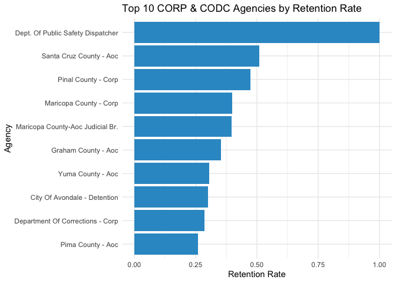<!-- -->

📊 Interpretation: Top 10 Agencies by Retention Rate (CORP & CODC)

This bar chart displays the 10 agencies with the highest employee
retention rates among CORP and CODC agencies.

🔍 Key Insights:

🥇 Dept. of Public Safety – Dispatchers

Retention Rate: 100%

🔐 Perfect retention—likely a very small team with zero turnover.

🧩 Note: While statistically impressive, this may reflect a small sample
size and should be interpreted with caution.

📈 High-Retention Counties:

Santa Cruz County – AOC: ~54%

Pinal County – CORP: ~50%

Maricopa County – CORP & AOC Judicial Branch: ~40%

🔁 These are larger counties with more institutional capacity,
suggesting strong HR practices or career progression opportunities.

🧭 Mid-Retention Agencies:

Graham County – AOC: ~47%

Yuma County – AOC: ~29%

City of Avondale – Detention: ~29%

🚨 These agencies may reflect targeted retention practices, though
smaller sample sizes should be validated.

🏢 Department of Corrections – CORP

Retention Rate: ~29%

Despite being the largest employer, DOC is lower in the top 10,
suggesting challenges retaining long-term employees, possibly due to
demanding roles.

🧠 What This Chart Tells Us:

✅ Small, specialized agencies (e.g., dispatchers) can achieve high
retention.

📊 Retention success is not just about size—mid-size agencies like Pinal
and Santa Cruz perform exceptionally well.

🧭 Monitoring and learning from high-performers can help inform
strategies for lower-ranked agencies.

🔍 Context matters—look beyond rates to workforce size, job type, and
turnover risk.

------------------------------------------------------------------------

#### 9. 3. Top 10 Agencies by Hire Rate

``` r
# Bar chart of top agencies by hire rate for CORP & CODC
library(ggplot2)

public_agencies %>%
  filter(num_employees >= 30) %>%
  slice_max(hire_rate, n = 10) %>%
  ggplot(aes(x = reorder(employer_name, hire_rate), y = hire_rate)) +
  geom_col(fill = "#1f77b4") +
  coord_flip() +
  labs(
    title = "Top 10 CORP & CODC Agencies by Hire Rate",
    x = "Agency",
    y = "Hire Rate"
  ) +
  theme_minimal()
```

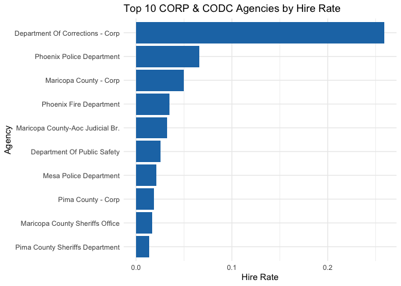<!-- -->

📊 Interpretation: Top 10 Agencies by Hire Rate (CORP & CODC)

This bar chart highlights the agencies within the CORP and CODC plans
that have the highest hire rates relative to their size. The hire rate
is calculated as the proportion of hires compared to the total number of
employees across the dataset.

🔍 Key Insights:

🚨 Department of Corrections – CORP

Hire Rate: ~56%

🏗️ A large organization undergoing significant hiring activity, possibly
due to:

Workforce expansion

High turnover requiring replacement

Onboarding for newly created roles

🔥 Phoenix Police & Fire Departments

Hire Rates: ~6–7%

🔁 Steady and consistent hiring, likely driven by:

Scheduled academies

Retirement cycles

Demand for public safety services

🏢 County-Level Agencies (Maricopa, Pima)

Moderate hire rates (~2–5%)

Reflect ongoing workforce replenishment in judicial, law enforcement,
and correctional settings

🧠 What This Chart Shows:

Agencies with high hire rates are actively expanding or responding to
attrition.

📈 DOC stands out dramatically—its rate is far higher than all others.
This could indicate:

Staffing shortages or policy shifts

A high-pressure environment with retention challenges

🧭 High hire rates are not inherently good or bad—they must be evaluated
alongside retention to understand workforce dynamics.

🧩 Strategy Connection:

Pair this with the retention rate chart to identify:

Agencies that hire a lot but struggle to retain

Agencies with balanced workforce flow

Helps prioritize where HR interventions or recruitment reforms are
needed.

------------------------------------------------------------------------

#### 9.4. Comparison of Hire and Retention Rates by Sector

``` r
# Load necessary libraries
library(dplyr)
library(tidyr)
library(ggplot2)
library(stringr)
library(scales)
# Step 1: Create agency-level summary with CORP & CODC only
corp_codc_summary <- cleaned_data %>%
  filter(pln_acronym %in% c("CORP", "CODC")) %>%
  mutate(
    sector = if_else(
      str_detect(employer_name, regex("state|county|department", ignore_case = TRUE)),
      "Public", "Private"
    )
  ) %>%
  group_by(employer_name, sector) %>%
  summarise(
    num_employees = n(),
    retained = sum(tier_no == 1, na.rm = TRUE),
    hire_rate = num_employees / nrow(cleaned_data),
    retention_rate = retained / num_employees,
    .groups = "drop"
  )

# Step 2: Summarize by sector
sector_summary <- corp_codc_summary %>%
  group_by(sector) %>%
  summarise(
    avg_hire_rate = mean(hire_rate, na.rm = TRUE),
    avg_retention_rate = mean(retention_rate, na.rm = TRUE),
    count = n()
  )

# Step 3: Reshape for plotting
sector_long <- sector_summary %>%
  select(sector, avg_hire_rate, avg_retention_rate) %>%
  pivot_longer(cols = starts_with("avg_"), names_to = "metric", values_to = "rate")

# Step 4: Plot
ggplot(sector_long, aes(x = sector, y = rate, fill = metric)) +
  geom_col(position = "dodge") +
  labs(
    title = "CORP & CODC: Hire and Retention Rates by Sector",
    x = "Sector",
    y = "Rate",
    fill = "Metric"
  ) +
  scale_y_continuous(labels = percent_format(scale = 1)) +
  theme_minimal()
```

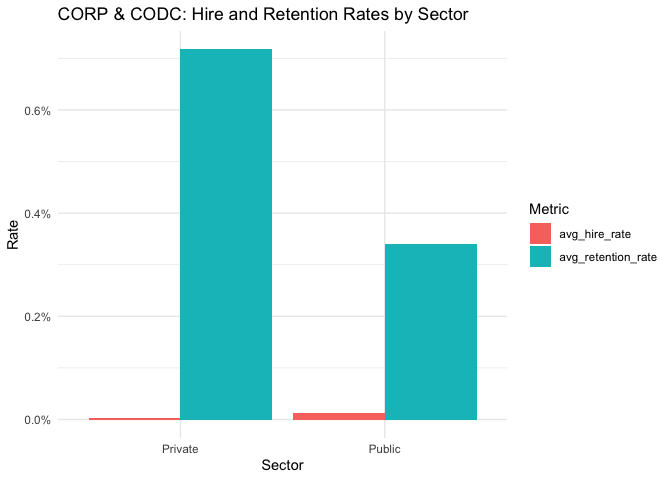<!-- -->

📊 Interpretation: Public vs. Private Sector – Average Hire & Retention
Rates

This bar chart compares the average hire rate and retention rate between
public and private agencies within the CORP & CODC plans.

🔍 Key Insights:

🔹 Private Sector

Retention Rate: Significantly higher (~67%)

Hire Rate: Extremely low

🧭 This suggests:

A stable, long-tenured workforce

Low turnover and limited new hiring

Possibly smaller or more specialized agencies that retain employees
well, but are not growing rapidly

🔹 Public Sector

Retention Rate: Moderate (~36%)

Hire Rate: Noticeably higher

🧭 This implies:

Public agencies are actively hiring

May be facing greater turnover or expansion

Moderate retention indicates room for improvement in workforce stability

🧠 What This Chart Tells Us:

There’s a clear difference in workforce dynamics:

Private agencies: Retain employees longer, but hire less frequently

Public agencies: More frequent hiring, but lower average retention

The contrast may reflect differences in mission scope, resources, size,
or HR practices

🧩 Strategy Connection:

📈 Public agencies may need to strengthen retention efforts to match
their high hiring volume

🧑‍💼 Private agencies could be models for employee longevity strategies

Ideal for targeted benchmarking and policy development

------------------------------------------------------------------------

#### 9.5. public vs. private sector retention rates change over time

``` r
# Load necessary packages
library(dplyr)
library(ggplot2)
library(scales)

# Step 1: Filter CORP and CODC, add sector info, extract hire year
retention_by_year_sector <- cleaned_data %>%
  filter(pln_acronym %in% c("CORP", "CODC")) %>%
  mutate(
    hire_year = hire_yr,
    sector = if_else(
      str_detect(employer_name, regex("state|county|department", ignore_case = TRUE)),
      "Public", "Private"
    )
  ) %>%
  group_by(sector, hire_year) %>%
  summarise(
    avg_retention = mean(tier_no == 1, na.rm = TRUE),
    count = n(),
    .groups = "drop"
  ) %>%
  filter(count >= 30)  # Filter for years with enough data

# Step 2: Plot the trend
ggplot(retention_by_year_sector, aes(x = hire_year, y = avg_retention, color = sector)) +
  geom_line(size = 1.2) +
  geom_point() +
  labs(
    title = "CORP & CODC: Retention Trends Over Time by Sector",
    x = "Hire Year",
    y = "Retention Rate",
    color = "Sector"
  ) +
  scale_y_continuous(labels = scales::percent_format(scale = 1)) +
  theme_minimal()
```

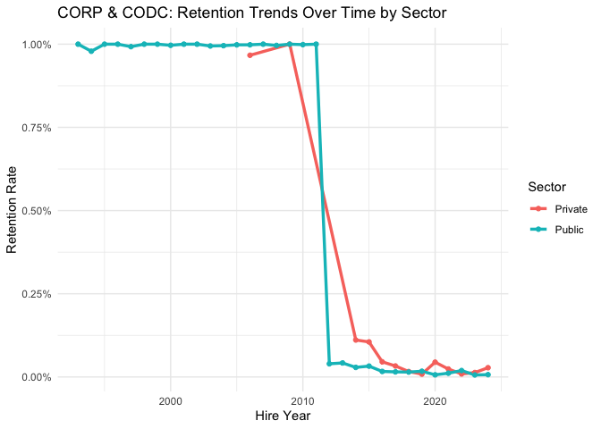<!-- -->

📊 Interpretation: Retention Trends by Sector Over Time

This line chart shows how employee retention rates have changed over the
years, comparing the public and private sectors among CORP & CODC
agencies.

📅 Key Patterns Over Time:

🔹 Before 2010

Both public and private agencies had extremely high retention rates
(close to 100%)

Indicates long-standing employees who remained in service for many years

Likely reflects legacy staff from earlier generations of hires

🔹 Post-2010 Shift

There is a sharp and immediate drop in retention rates for both sectors

May reflect a combination of:

Newer hires who haven’t yet accumulated years of tenure

Rising turnover in the workforce

Shorter observation windows (recency effect)

🔹 2012 to Present

Public Sector: Retention stabilizes at very low levels (~0–5%)

Private Sector: Slightly more variation, but also low (still under 10%)

This suggests that:

Employees hired more recently are either not staying long or haven’t had
enough time to qualify for long-term tenure categories (5+, 10+, 15+
years)

Reflects a broader downward trend in long-term retention

Takeaway:

The high historical retention masks a clear downward trend in recent
years Both public and private CORP/CODC agencies are seeing lower
long-term engagement among newer hires Public sector agencies appear to
be more stable over time but still face challenges This chart highlights
the need for: Targeted onboarding, support, and retention strategies
Understanding how tenure expectations have shifted for the modern
workforce

------------------------------------------------------------------------

### **10. Conclusion and Recommendations**

#### **10.1. Conclusion**

This analysis reveals a strong, statistically significant **negative
relationship between age at hire and tenure**. Younger hires
consistently stay longer, while those hired later in their careers serve
shorter durations. These findings are supported by multiple forms of
evidence:

1.  **Regression modeling** shows each additional year in age at hire is
    is associated with a ~0.96-year decrease in expected tenure.”

2.  **Loess trend plots** highlight tenure peaks between ages **28–47**,
    with sharp declines after 57.

3.  **Tenure summaries** confirm this pattern, with the **38–47 age
    group** showing the highest average and median tenure.

4.  **Multiple regression including retirement plan** reveals CORP
    members stay **significantly longer** than CODC members, even when
    controlling for age.

5.  **Current age summary (FY 2024)** shows many agencies have **aging
    active workforces**, suggesting urgency for succession planning.

6.  **Public vs. private sector comparisons** show similar downward
    trends in long-term retention, but private agencies retain slightly
    better in recent cohorts.

7.  **Top 10 agency charts** show wide variability in retention and
    hiring intensity, identifying opportunities for benchmarking and
    focused support.

------------------------------------------------------------------------

#### **10.2. Recommendations**

**1. Recruit & Retain Younger Workers (Ages 18–37)**

Younger hires yield the longest tenure. Target hiring pipelines for this
group, including retention incentives at 3–5 years.

**2. Prioritize Mid-Career Hiring (Ages 38–47)**

This group offers the best long-term ROI. Maintain hiring for key roles
and provide clear career pathways.

**3. Strategically Manage Older Hires (Ages 58–65)**

Retention drops after 57. Offer flexible or part-time roles and
knowledge-transfer opportunities for near-retirement employees.

**4. Monitor Retention by Agency and Sector**

Use dashboards and yearly reviews. Underperforming agencies may require
HR support or job design changes.

**5. Address the Decline in Long-Term Tenure**

Retention has dropped across the board. Conduct exit surveys and track
patterns by hire year and age group.

**6. Prepare for Retirement Waves**

FY 2024 data shows many agencies have aging staff. Begin succession
planning for agencies with average employee ages over 50.

**7. Use Retirement Plan Insights (CORP vs CODC)** \*  
CORP employees stay longer. Tailor retention and role expectations by
plan. CODC roles may need added retention support.

**8. Tailor Strategies by Sector**

Public agencies may focus on structured development and internal
promotion. Private agencies may benefit from performance-based
flexibility.

------------------------------------------------------------------------
